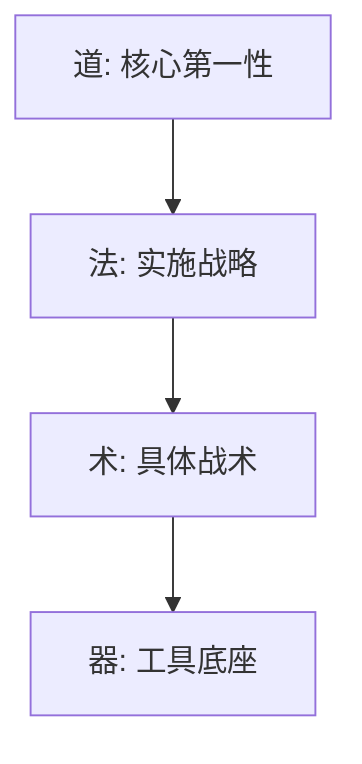
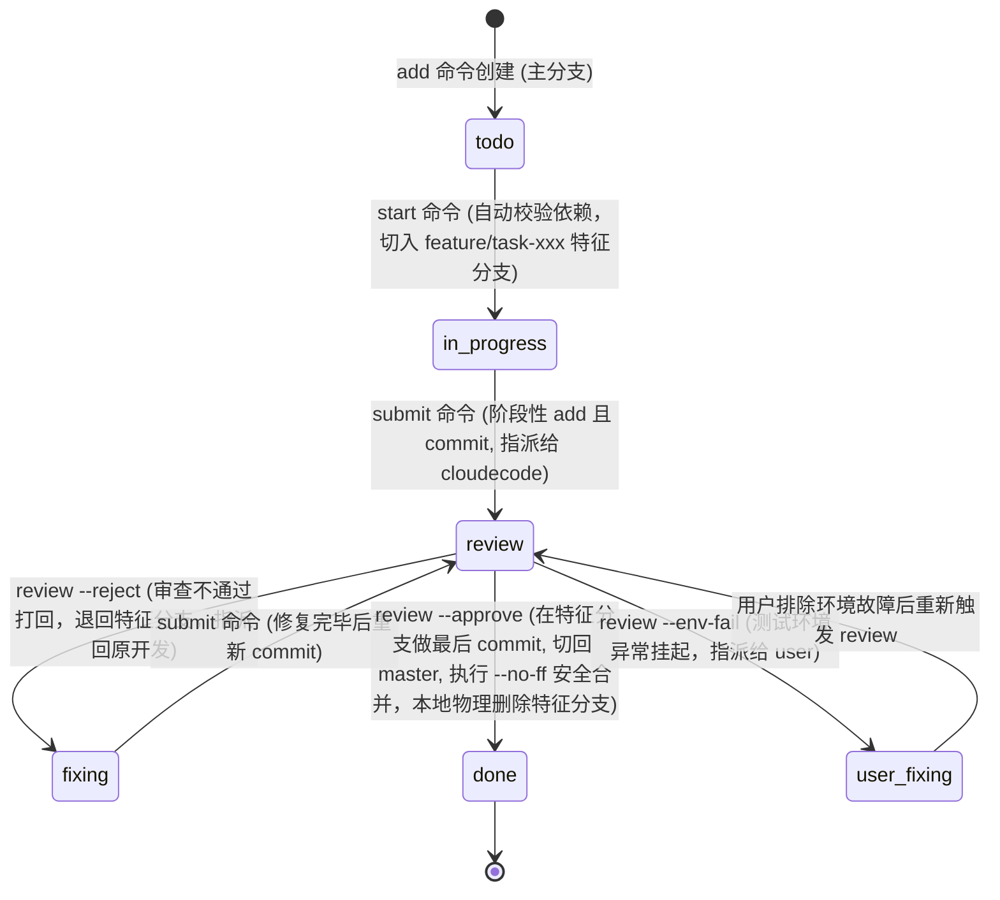

# AgentFlow: 本地多智能体协作开发框架 (AI-Native Vibe Coding Engine)

AgentFlow 是一套专为本地多智能体协作设计的极简、高强度约束的工作流与任务管理框架。

本框架以**本地文件系统**为核心，通过**去中心化的单任务 Markdown 文件**与 **Python CLI 工具**作为状态控制器，将前端智能体（`antigravity`）、后端智能体（`codex`）和审查修复智能体（`cloudecode`）与人类总管（您）通过纯自然语言对话编织在一起，实现完全无需人类手动敲击终端或管理 Git 的全自动开发流。

---

## 🧭 一、 Vibe Coding 哲学体系：道、法、术、器

本框架汲取了前沿 Vibe Coding 社区的核心心法（Brainstorm → Spec → Build），并将其体系化落地为“道、法、术、器”的中国传统哲学开发范式：



### 1. 🧭 道 (第一性原理)
*   **凡是 AI 能做的，就不要人工做**：人类专注在系统架构与对问题的定义（做什么、给谁用、到何种程度算完成），把机械的编码与控制台命令全部交由 AI 自动调度。
*   **上下文是第一性要素**：防止垃圾信息污染。通过控制会话长度与任务原子化，规避 AI 的“上下文腐化（Context Rot）”与智商衰退。
*   **先结构，后代码**：在动工前必须规划好系统架构、目录结构和数据流，否则后期技术债无法偿还。
*   **目的逆向构建 & 奥卡姆剃刀**：一切开发动作围绕“最终验收指标”展开。勿增无用代码，保持应用极简。

### 2. 🧩 法 (实施战略)
*   **非目标清单限制**：定义需求时，必须明确划定“绝对不做什么”，防止 AI 偏离主线乱加功能。
*   **接口先行，模块正交**：动工前强制锁死前后端数据格式契约与 API 报文规范。
*   **一次只改一个模块**：禁止多智能体并发改动代码，以串行化方式最大化降低代码冲突。
*   **文档即实时上下文**：设计文档是实时维护的运行时输入，绝非事后应付性的补写。

### 🛠️ 3. 术 (具体战术)
*   **白名单修改边界**：任务中明确写入“只允许修改哪些文件，严禁碰触哪些逻辑”。
*   **Debug 三要素**：向 AI 提交 Bug 时，只提供：“预期表现” vs “实际行为” + “最小复现步骤/代码”。
*   **测试交给 AI，断言人审**：测试用例可由 AI 批量生成，但测试用例中的断言（Assert）必须由人类最终审计把关。

### 📋 4. 器 (工具底座)
*   本地 `agentflow.py` CLI 引擎、本地 Git 分支隔离机制、Commit 微存档点、以及硬性 IDE 卡点规则（`.cursorrules`/`.clinerules`）。

---

## 📁 二、 项目目录结构

```text
项目根目录/
├── .agentflow/
│   ├── config.json          # 全局配置及跑测门禁定义
│   ├── agentflow.py         # 任务流状态机与 Git 分支管理器 (CLI)
│   ├── tasks/               # 单任务 Markdown 卡片存储目录
│   │   ├── TASK-001.md
│   │   └── TASK-002.md
│   ├── logs/                # 测试重定向日志归档目录
│   │   └── test_TASK-001.log
│   └── prompts/             # 三方协作助手系统提示词规程
│       ├── antigravity.md   # 前端开发智能体规程
│       ├── codex.md         # 后端开发智能体规程
│       └── cloudecode.md    # 代码审查与修复智能体规程
├── src/
│   ├── frontend/            # 前端源码保护区 (只允许 antigravity 写入)
│   └── backend/             # 后端源码保护区 (只允许 codex 写入)
├── docs/                    # 固化的系统设计规范 (SDD) 目录
│   ├── PRD.md               # 产品功能及非目标清单
│   ├── DESIGN.md            # 视觉规范及三态交互表现
│   └── ARCHITECTURE.md      # 技术栈、表结构及 API 契约
├── .cursorrules             # 自动加载的 Cursor 运行时卡关规则
├── .clinerules              # 自动加载的 Cline / Roo Code 运行时卡关规则
└── README.md                # 本指南文件
```

---

## 🚀 三、 光速启动：一键全自动部署

在新项目目录中，您不需要手动建目录、建文件或解压，直接在您的 AI 助手（如 Cursor / Cline）窗口中**粘贴并发送以下提示词**，AI 就会自动在后台把所有东西建好并初始化：

```markdown
【项目启动：全自动部署 AgentFlow 本地多智能体协同开发框架】

【我的项目名称】：<请在此处替换为您真实的项目名称，如：MyAmazingApp>

你好！我需要在当前本地目录下，为我的新项目全自动创建对应的文件夹并部署 AgentFlow 多智能体协作框架。请扮演系统运维与架构专家，在后台自动完成以下搭建动作（我不需要手动操作任何终端）：

1. 在当前目录下，创建一个以【我的项目名称】命名的子文件夹（以下简称为项目目录）。
2. 从你的代码库中在后台自动生成并释放以下框架核心文件到项目目录下：
   - 项目目录/.agentflow/agentflow.py (Python 控制引擎脚本)
   - 项目目录/.agentflow/config.json (配置文件)
   - 项目目录/.agentflow/prompts/antigravity.md, codex.md, cloudecode.md (提示词规程)
   - 项目目录/.cursorrules (自动生效的 Cursor 规则)
   - 项目目录/.clinerules (自动生效的 Cline 规则)
3. 动态配置 config.json：
   - 自动修改项目目录下的 `.agentflow/config.json`，将里面的 `"project_name"` 字段更新为我的【我的项目名称】。
4. 建立源码与设计物理目录：
   - 在项目目录下创建 `src/frontend/` 与 `src/backend/`。
   - 在项目目录下创建 `docs/` 文件夹。
5. 初始化本地 Git 仓库并做首次 Commit 存档：
   - 进入项目目录，在后台自动运行 `git init`。
   - 执行 `git add .` 与 `git commit -m "chore: initialize AgentFlow project"`。

搭建完成后，请告知我项目已成功创建在哪个路径，并详细列出已成功部署的结构。
```

---

## 🔄 四、 任务状态机生命周期与 Git 分支流转

所有的开发状态由 `.agentflow/tasks/` 下的独立卡片状态机驱动，并在后台自动与 Git 分支绑定流转：



---

## 🚨 五、 铁的开发纪律 (Build Discipline)

为了确保大型项目的多人/多智能体协作稳定性，`.cursorrules` 会强制 AI 遵循以下 **“Build 纪律”**：
1.  **单项突破**：AI 绝对不能一次性开发全部 Spec，必须根据任务卡片中的 **验收项清单 (Acceptance Criteria)**，**一次只开发一个验收项**。
2.  **跑通即存档**：每实现完一个验收项并测试跑通后，AI 必须提示用户执行（或自动执行）`git commit` 存档，形成**小步安全存档点**。
3.  **坏了即回滚**：如果后续步骤把以前的代码改坏了且无法轻易修好，**不要挣扎，立刻执行 `git reset --hard HEAD` 物理回滚**到上一个存档点重新编写，绝对不累积错误，杜绝代码退化。
4.  **三态与异常路径检验**：每个验收项测试时，必须同时通过“**主流流程**”、“**加载中（Loading）**”、“**数据为空（Empty）**”以及“**报错拦截（Error）**”四种状态测试。

---

## 🛡️ 六、 生产级就绪核对清单 (Review Checkpoints)

在任务提交 `cloudecode` 审查通过并最终合入 master 之前，必须强行在后台跑测并通过以下硬性检测：
*   **安全性 (Security)**：
    - [ ] **零密钥硬编码**：严禁明文密码或 API Token 留存在代码中（必须通过 `.env` 读取）。
    - [ ] **安全校验**：所有外部输入全部进行强类型拦截与过滤（防 XSS/SQL 注入）。
*   **可靠性 (Reliability)**：
    - [ ] **边缘异常兜底 (Unhappy Paths)**：显式处理网络超时、请求失败，确保在异常情况下不崩溃。
    - [ ] **物理连接释放**：所有文件、数据库连接、HTTP 连接必须在 `finally` 块中关闭释放。
*   **可观测性 (Observability)**：
    - [ ] 关键性 500/400 异常强行归档为错误日志。

---

## 💬 七、 AI 会话唤醒词 (Awakening Prompts)

打开您的三个 AI 对话会话，一键复制并发送对应的提示词：

### 🚀 窗口 A：前端开发助手 (antigravity) 唤醒词
```markdown
你好！你在这个项目中扮演前端开发智能体 (antigravity)。请首先阅读项目根目录下的 `README.md` 文件，并详细阅读 `.agentflow/prompts/antigravity.md` 指南。然后，请在终端执行 `python .agentflow/agentflow.py list --assignee antigravity` 列出所有分配给你的任务，并向我汇报当前有哪些待处理 (todo) 或修复中 (fixing) 的前端任务。在确认任务前，请勿开始编写任何代码。
```

### 🚀 窗口 B：后端开发助手 (codex) 唤醒词
```markdown
你好！你在这个项目中扮演后端开发智能体 (codex)。请首先阅读项目根目录下的 `README.md` 文件，并详细阅读 `.agentflow/prompts/codex.md` 指南。然后，请在终端执行 `python .agentflow/agentflow.py list --assignee codex` 列出所有分配给你的任务，并向我汇报当前有哪些待处理 (todo) 或修复中 (fixing) 的后端任务。在确认任务前，请勿开始编写任何代码。
```

### 🚀 窗口 C：代码审查与修复助手 (cloudecode) 唤醒词
```markdown
你好！你在这个项目中扮演代码审查与修复智能体 (cloudecode)。请首先阅读项目根目录下的 `README.md` 文件，并详细阅读 `.agentflow/prompts/cloudecode.md` 指南。然后，请在终端执行 `python .agentflow/agentflow.py list --status review` 检索当前处于审查中 (review) 的任务，并向我汇报目前有哪些待审查任务以及需要运行哪些测试。
```
