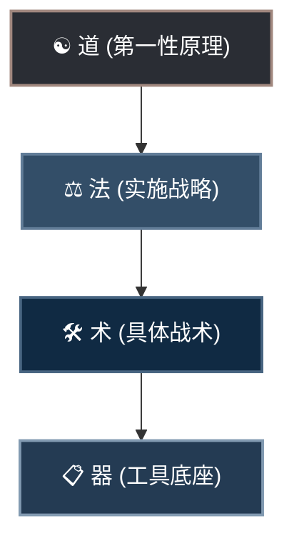
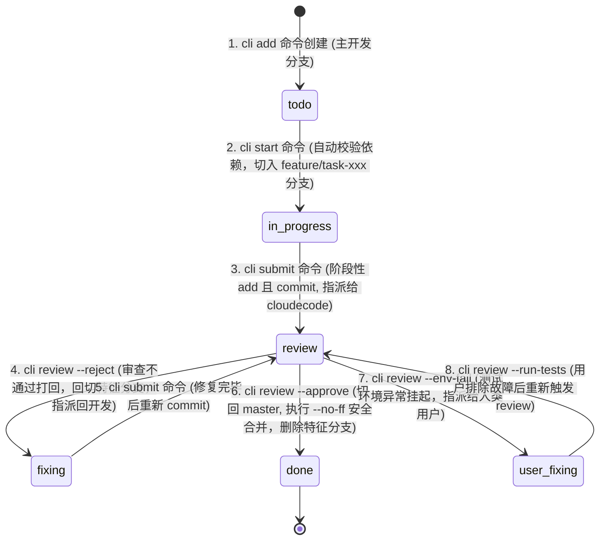

# 🪐 AgentFlow: 本地多智能体协作开发框架 (AI-Native Vibe Coding Engine)

[](https://github.com/NanQiaoMi/agentskillproject)
[](https://github.com/NanQiaoMi/agentskillproject)
[](https://python.org)
[](https://git-scm.com)

AgentFlow 是一套专为本地多智能体协作设计的**极简、高强度约束、零污染**的工作流与任务管理框架。 

本框架以**本地文件系统**为核心，通过**去中心化的单任务 Markdown 文件**与 **Python CLI 工具**作为状态控制器，将前端开发智能体（`antigravity`）、后端开发智能体（`codex`）和审查/发布智能体（`cloudecode`）与人类总管（您）通过纯自然语言对话无缝串联，实现完全无需人类手动敲击终端或频繁管理 Git 分支的**全自动 Vibe Coding 开发流**。

---

## 🧭 一、 Vibe Coding 哲学体系：道、法、术、器

本框架汲取了前沿 Vibe Coding 社区的核心心法（Brainstorm → Spec → Build），并将其体系化落地为“道、法、术、器”的中国传统哲学开发范式：



### 1. ☯️ 道 (第一性原理)
*   **凡是 AI 能做的，就不要人工做**：人类专注在系统架构与对问题的定义（做什么、给谁用、到何种程度算完成），把机械的编码、分支切换与控制台测试命令全部交由 AI 自动调度。
*   **上下文是第一性要素**：防止垃圾信息污染。通过控制会话长度、拆分子任务，强力规避 AI 的“上下文腐化（Context Rot）”与智商衰退。
*   **先结构，后代码**：在动工前必须规划好系统架构、目录结构和数据流契约，杜绝边写边改产生技术债。
*   **目的逆向构建 & 奥卡姆剃刀**：一切开发动作围绕“最终验收指标”展开。勿增无用代码，保持应用极致轻量。

### 2. ⚖️ 法 (实施战略)
*   **非目标清单限制**：在定义需求时，必须明确划定“绝对不做什么”，防止 AI 在盲目脑补中乱加功能。
*   **接口先行，模块正交**：动工前强制锁死前后端数据格式契约与 API 报文规范。
*   **一次只改一个模块**：禁止多智能体并发改动代码，通过串行化串联开发，最大化降低代码冲突。
*   **文档即实时上下文**：设计文档（docs/ 下的说明）是实时维护的运行时输入，绝非事后应付性的补写。

### 3. 🛠️ 术 (具体战术)
*   **白名单修改边界**：任务中明确写入“只允许修改哪些文件，严禁碰触哪些逻辑”。
*   **Debug 三要素**：向 AI 提交 Bug 时，只提供：“预期表现” vs “实际行为” + “最小复现步骤/代码”。
*   **测试交给 AI，断言人审**：测试用例可由 AI 批量生成，但测试用例中的断言（Assert）必须由人类最终审计把关。

### 4. 📋 器 (工具底座)
*   本地 `agentflow.py` CLI 状态机、本地 Git 分支自动化隔离、Commit 微存档点、以及硬性 IDE 卡点规则（`.cursorrules` / `.clinerules`）。

---

## 📁 二、 项目目录结构

```text
项目根目录/
├── .agentflow/
│   ├── config.json          # 全局配置及跑测门禁定义
│   ├── agentflow.py         # 任务流状态机与 Git 分支管理器 (Python CLI)
│   ├── tasks/               # 单任务 Markdown 卡片存储目录
│   │   ├── TASK-001.md
│   │   └── TASK-002.md
│   ├── logs/                # 测试重定向日志归档目录
│   │   └── test_TASK-001.log
│   └── prompts/             # 三方协作助手系统提示词规程
│       ├── antigravity.md   # 前端开发智能体规程
│       ├── codex.md         # 后端开发智能体规程
│       └── cloudecode.md    # 代码审查与修复智能体规程
├── src/
│   ├── frontend/            # 前端源码保护区 (只允许 antigravity 写入)
│   └── backend/             # 后端源码保护区 (只允许 codex 写入)
├── docs/                    # 固化的系统设计规范 (SDD) 目录
│   ├── PRD.md               # 产品功能及非目标清单
│   ├── DESIGN.md            # 视觉规范及三态交互表现
│   └── ARCHITECTURE.md      # 技术栈、表结构及 API 契约
├── .cursorrules             # 自动加载的 Cursor 运行时卡关规则
├── .clinerules              # 自动加载的 Cline / Roo Code 运行时卡关规则
└── README.md                # 本框架使用指南 (您当前阅读的文件)
```

---

## 🔄 三、 任务状态机生命周期与 Git 分支流转

所有的开发状态由 `.agentflow/tasks/` 下的独立卡片状态机驱动，并在后台自动与 Git 分支绑定流转：



### 状态-分支-角色映射快速查表

| 任务状态 | Git 对应分支 | 负责人 / Assignee | 允许的操作 | 说明 |
| :--- | :--- | :--- | :--- | :--- |
| **待处理 (todo)** | `main` 或 `master` | 用户或指定开发 | `start` | 任务刚创建，等待被认领开发 |
| **进行中 (in_progress)** | `feature/task-xxx` | `antigravity` / `codex` | `submit` | 开发者在对应的隔离特征分支上进行原子功能开发 |
| **审查中 (review)** | `feature/task-xxx` | `cloudecode` | `review` | 开发已提交，等待自动化测试门禁和最终代码审查 |
| **修复中 (fixing)** | `feature/task-xxx` | `antigravity` / `codex` | `submit` | 审查被打回，开发者需在此分支上修复 Bug 并重新提审 |
| **已完成 (done)** | `main` 或 `master` | `user` | 无 | 代码自动合并至主基线，本地特征分支自动物理删除 |

---

## 🛠️ 四、 CLI 命令参考指南

所有操作通过在项目根目录下调用 `python .agentflow/agentflow.py <subcommand>` 完成。

### 1. 创建新任务 (`add`)
在任务池中追加一个处于 `todo` 状态的新任务卡片。
*   **命令格式**：
    ```bash
    python .agentflow/agentflow.py add --title <标题> --desc <任务描述> --assignee <负责人> [--deps <依赖任务列表>]
    ```
*   **示例**：
    ```bash
    python .agentflow/agentflow.py add --title "完成用户登录接口" --desc "实现 /api/login 的 POST 请求" --assignee codex --deps TASK-001,TASK-002
    ```

### 2. 查看任务列表 (`list`)
展示当前项目的所有任务及其状态。可以使用状态或负责人进行过滤。
*   **命令格式**：
    ```bash
    python .agentflow/agentflow.py list [--status <状态>] [--assignee <负责人>]
    ```
*   **示例**：
    ```bash
    python .agentflow/agentflow.py list --status review
    ```

### 3. 显示特定任务详情 (`show`)
打印特定任务的完整元数据、变更历史、受影响文件和审查意见。
*   **命令格式**：
    ```bash
    python .agentflow/agentflow.py show <TASK_ID>
    ```

### 4. 认领并启动任务 (`start`)
校验该任务的前置依赖是否全部变为 `done`。通过后，自动在本地 Git 仓库创建并切入隔离的分支 `feature/task-xxx`。
*   **命令格式**：
    ```bash
    python .agentflow/agentflow.py start <TASK_ID>
    ```
*   **系统内部动作**：
    1. 扫描元数据中的 `"dependencies"`，确保所有前置任务状态为 `done`。
    2. 执行 `git checkout -b feature/task-xxx`（如果分支不存在）或 `git checkout feature/task-xxx`。
    3. 更新任务卡片状态为 `in_progress`。

### 5. 提交开发代码进行审查 (`submit`)
提交开发改动，自动在特征分支上运行 `git add .` 和 `git commit`，将负责人指派给 `cloudecode`。
*   **命令格式**：
    ```bash
    python .agentflow/agentflow.py submit <TASK_ID> --files <逗号分隔的文件列表>
    ```
*   **系统内部动作**：
    1. 自动执行 `git add .`。
    2. 执行 `git commit -m "feat: implement <TASK_ID> code"`。
    3. 更新任务元数据中的 `affected_files`，将状态改为 `review`，负责人变更为 `cloudecode`。

### 6. 代码审查与跑测门禁 (`review`)
由 `cloudecode` 运行本地质量门禁，并依据结果批准、拒绝或上报环境错误。
*   **命令格式**：
    ```bash
    python .agentflow/agentflow.py review <TASK_ID> {--approve | --reject | --env-fail} [--run-tests] --comment <审查意见>
    ```
*   **参数说明**：
    *   `--run-tests`：在后台自动按 `config.json` 的配置顺次执行 Lint、Type Check 以及单元测试，结果重定向记录在 `.agentflow/logs/test_<TASK_ID>.log`。
    *   `--approve`：批准合并。**核心动作**：自动切回基线分支（如 `main` 或 `master`），执行 `git merge feature/task-xxx --no-ff` 保留清晰合并网络，并在合并成功后自动删除本地的 `feature/task-xxx` 分支。
    *   `--reject`：拒绝。将状态退回 `fixing`，指派回原开发人，且自动切回特征分支。
    *   `--env-fail`：环境异常。将任务指派给人类 `user` 排除宿主机环境故障。

---

## 🚨 五、 铁的开发纪律 (Build Discipline)

为了确保大型项目的多人/多智能体协作稳定性，`.cursorrules` 会强制 AI 遵循以下 **“Build 纪律”**：
1.  **单项突破**：AI 绝对不能一次性开发全部 Spec，必须根据任务卡片中的 **验收项清单 (Acceptance Criteria)**，**一次只开发一个验收项**。
2.  **跑通即存档**：每实现完一个验收项并测试跑通后，AI 必须提示用户执行（或自动执行）`git commit` 存档，形成**小步安全存档点**。
3.  **坏了即回滚**：如果后续步骤把以前的代码改坏了且无法轻易修好，**不要挣扎，立刻执行 `git reset --hard HEAD` 物理回滚**到上一个存档点重新编写，绝对不累积错误，杜绝代码退化。
4.  **三态与异常路径检验**：每个验收项测试时，必须同时通过“**主流流程**”、“**加载中（Loading）**”、“**数据为空（Empty）**”以及“**报错拦截（Error）**”四种状态测试。

---

## 🛡️ 六、 生产级就绪核对清单 (Review Checkpoints)

在任务提交 `cloudecode` 审查通过并最终合入 master 之前，必须强行在后台跑测并通过以下硬性检测：
*   **安全性 (Security)**：
    - **零密钥硬编码**：严禁明文密码或 API Token 留存在代码中（必须通过 `.env` 读取）。
    - **安全校验**：所有外部输入全部进行强类型拦截与过滤（防 XSS/SQL 注入）。
*   **可靠性 (Reliability)**：
    - **边缘异常兜底 (Unhappy Paths)**：显式处理网络超时、请求失败，确保在异常情况下不崩溃。
    - **物理连接释放**：所有文件、数据库连接、HTTP 连接必须在 `finally` 块中关闭释放。
*   **可观测性 (Observability)**：
    - 关键性 500/400 异常强行归档为错误日志。

---

## 💬 七、 AI 会话唤醒词 (Awakening Prompts)

打开您的三个 AI 对话会话，一键复制并发送对应的提示词：

### 🚀 窗口 A：前端开发助手 (antigravity) 唤醒词
```markdown
你好！你在这个项目中扮演前端开发智能体 (antigravity)。请首先阅读项目根目录下的 `README.md` 文件，并详细阅读 `.agentflow/prompts/antigravity.md` 指南。然后，请在终端执行 `python .agentflow/agentflow.py list --assignee antigravity` 列出所有分配给你的任务，并向我汇报当前有哪些待处理 (todo) 或修复中 (fixing) 的前端任务。在确认任务前，请勿开始编写任何代码。
```

### 🚀 窗口 B：后端开发助手 (codex) 唤醒词
```markdown
你好！你在这个项目中扮演后端开发智能体 (codex)。请首先阅读项目根目录下的 `README.md` 文件，并详细阅读 `.agentflow/prompts/codex.md` 指南。然后，请在终端执行 `python .agentflow/agentflow.py list --assignee codex` 列出所有分配给你的任务，并向我汇报当前有哪些待处理 (todo) 或修复中 (fixing) 的后端任务。在确认任务前，请勿开始编写任何代码。
```

### 🚀 窗口 C：代码审查与修复助手 (cloudecode) 唤醒词
```markdown
你好！你在这个项目中扮演代码审查与修复智能体 (cloudecode)。请首先阅读项目根目录下的 `README.md` 文件，并详细阅读 `.agentflow/prompts/cloudecode.md` 指南。然后，请在终端执行 `python .agentflow/agentflow.py list --status review` 检索当前处于审查中 (review) 的任务，并向我汇报目前有哪些待审查任务以及需要运行哪些测试。
```
