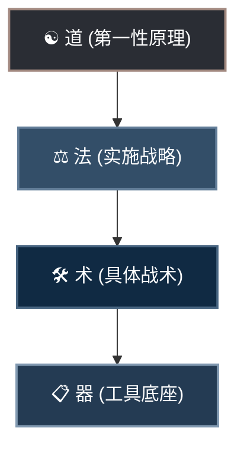
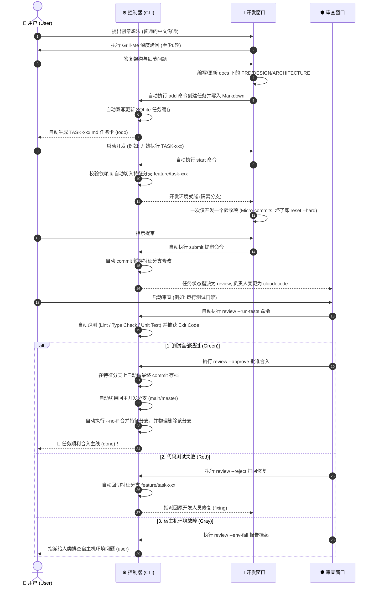
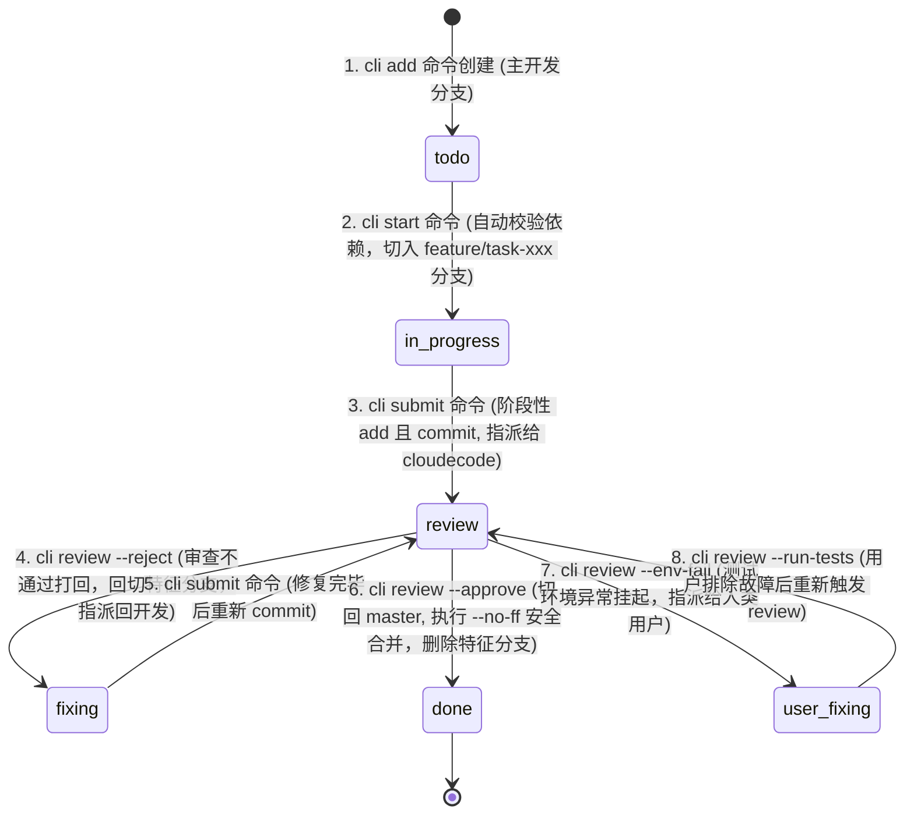

# 🪐 AgentFlow: 本地多智能体协作开发框架 (AI-Native Vibe Coding Engine)

[](https://github.com/NanQiaoMi/agentskillproject)
[](https://github.com/NanQiaoMi/agentskillproject)
[](https://python.org)
[](https://git-scm.com)
[](https://sqlite.org)

AgentFlow 是一套专为本地多智能体协作设计的**极简、高强度约束、生产就绪**的工作流与任务管理框架。

本框架以**本地文件系统**为核心，通过**去中心化的单任务 Markdown 文件**与 **Python 控制引擎**，将前端开发智能体（`antigravity`）、后端开发智能体（`codex`）和审查/发布智能体（`cloudecode`）与人类项目总管（您）通过纯自然语言对话无缝串联，实现免人工敲击终端、免手动管理 Git 分支的**全自动 Vibe Coding 本地开发流水线**。

---

## 🧭 一、 Vibe Coding 哲学体系：道、法、术、器

框架汲取了前沿 Vibe Coding 社区的核心心法（Brainstorm → Spec → Build），并将其体系化落地为“道、法、术、器”的开发范式：



### 1. ☯️ 道 (第一性原理)
*   **凡是 AI 能做的，就不要人工做**：人类专注在系统架构与对问题的定义（做什么、给谁用、到何种程度算完成），把机械的编码、分支切换与控制台测试命令全部交由 AI 自动调度。
*   **上下文是第一性要素**：防止垃圾信息污染。通过控制会话长度、拆分子任务，强力规避 AI 的“上下文腐化（Context Rot）”与智商衰退。
*   **先结构，后代码**：在动工前必须规划好系统架构、目录结构和数据流契约，杜绝边写边改产生技术债。
*   **目的逆向构建 & 奥卡姆剃刀**：一切开发动作围绕“最终验收指标”展开。勿增无用代码，保持应用极致轻量。

### 2. ⚖️ 法 (实施战略)
*   **非目标清单限制**：在定义需求时，必须明确划定“绝对不做什么”，防止 AI 在盲目脑补中乱加功能。
*   **接口先行，模块正交**：动工前强制锁死前后端数据格式契约与 API 报文规范。
*   **一次只改一个模块**：禁止多智能体并发改动代码，通过串行化串联开发，最大化降低代码冲突。
*   **文档即实时上下文**：设计文档（docs/ 下的说明）是实时维护的运行时输入，绝非事后应付性的补写。

### 3. 🛠️ 术 (具体战术)
*   **白名单修改边界**：任务中明确写入“只允许修改哪些文件，严禁碰触哪些逻辑”。
*   **Debug 三要素**：向 AI 提交 Bug 时，只提供：“预期表现” vs “实际行为” + “最小复现步骤/代码”。
*   **测试交给 AI，断言人审**：测试用例可由 AI 批量生成，但测试用例中的断言（Assert）必须由人类最终审计把关。

### 4. 📋 器 (工具底座)
*   本地 Python 控制引擎 + 本地隐藏 SQLite 缓存 + Git 自动化隔离分支 + 运行时拦截器（.cursorrules / .clinerules）。

---

## ⚡ 二、 框架新增核心高级特性

为了支撑大规模项目开发并保持本地协作的极致丝滑，AgentFlow v1.2.0 重磅引入了以下生产级特性：

### 1. 本地 SQLite 缓存索引加速 (Local DB Caching)
*   **痛点**：在大型项目中，当任务量增至数百个时，频繁 glob 扫描并解析 Markdown 头部 JSON 块会导致 `list` 命令出现 1-2 秒的肉眼延迟。
*   **机制**：引入双轨制存储方案：
    *   **真源 (Source of Truth)**：依然是 `.md` 任务卡片，方便 Git 追踪和人类直接编辑。
    *   **缓存层 (Cache Engine)**：本地隐藏 SQLite 数据库 `.agentflow/tasks.db`。
    *   **自动双写**：任何写操作（`add`、`start`、`submit`、`review`）都会自动将数据落盘并更新至 SQLite 中。
    *   **零延迟读取**：`list` 操作直接检索 SQLite 缓存（速度提升 100 倍以上，毫秒级响应）。
    *   **自动重构与退化**：提供 `python .agentflow/agentflow.py sync` 一键重构缓存。如果 SQLite 数据库不存在或环境不支持，脚本会自动执行全局扫描同步或退化为 glob 扫描，保障 100% 健壮性。

### 2. 头脑风暴与 Grill-Me 深度访谈 (6-Round Interview)
*   **机制**：提供了 `python .agentflow/agentflow.py brainstorm` 打印获取或一键复制的深度访谈唤醒词。
*   **烤问规范**：要求开发智能体在动手前执行 **至少 6 轮的深度烤问**（避免浅显发问），覆盖：
    *   技术栈选型与可行性分析（服务器成本、三方 API、安全隔离）；
    *   前端/后端组件与接口契约设计；
    *   交互三态细节表现（加载中 Loading、数据为空 Empty、接口/网络报错 Error）；
    *   异常边界路径（弱网重试、并发竞争锁、防重复提交校验、溢出处理）。
*   **卡片输出**：AI 整理出 docs/ 下的 SDD 文档（`PRD.md`、`DESIGN.md`、`ARCHITECTURE.md`）后，通过 `add` 自动创建带有 `[ ]` 格式验收清单的任务卡片，作为 Spec 双方同意的“确认键”。

### 3. 多级本地质量门禁 (Local Quality Gates)
*   **机制**：在 `.agentflow/config.json` 中扩展定义本地多阶段静态/动态自动卡关，包括 `lint_command`、`type_check_command` 与 `test_command`。
*   **执行与重定向**：`cloudecode` 跑测时会在后台重定向 STDOUT/STDERR 到 `.agentflow/logs/test_TASK-XXX.log` 并捕获退出码。任意一个阶段报错直接打回，保证合入主干的分支具备高水准稳定性。
*   **环境异常分离**：若测试失败是由于开发机缺少基础运行库或端口冲突等，可运行 `review --env-fail` 挂起，指派给人类（`user`）排查，防止无效的代码修改循环。

### 4. 任务目录Epic分组管理 (Epic Grouping)
*   **机制**：支持按照 Epic/模块 在 `.agentflow/tasks/` 下建立子文件夹（例如：`.agentflow/tasks/auth/TASK-001.md`），控制引擎基于递归 Glob 机制，能够自动且无感知地在子目录下定位、解析和流转任务文件。

### 5. 防死循环熔断机制 (Self-healing Loop)
*   **机制**：如果任务在 `review`（审查）与 `fixing`（修复）状态之间往复重试超过 3 次且原因一致，`cloudecode` 规程强制触发**死循环熔断**，自动将任务通过 `env-fail` 挂起或指派回人类，防止智能体在逻辑盲区中无限死锁。

---

## 📁 三、 项目目录结构

```text
项目根目录/
├── .agentflow/
│   ├── config.json          # 全局配置及多级质量门禁跑测指令
│   ├── agentflow.py         # 状态机控制器、SQLite 缓存与 Git 自动化 CLI
│   ├── tasks.db             # [自动生成] 本地 SQLite 缓存数据库 (Git 忽略)
│   ├── tasks/               # 去中心化任务卡片目录 (支持子目录分组管理)
│   │   ├── auth/            # 模块/Epic 分组
│   │   │   └── TASK-001.md
│   │   └── TASK-002.md
│   ├── logs/                # 测试重定向日志归档目录 (Git 忽略)
│   │   └── test_TASK-001.log
│   └── prompts/             # 三方协作助手系统提示词规程
│       ├── antigravity.md   # 前端开发智能体规程
│       ├── codex.md         # 后端开发智能体规程
│       └── cloudecode.md    # 审计与卡关审查智能体规程
├── src/
│   ├── frontend/            # 前端源码保护区 (只允许 antigravity 写入)
│   └── backend/             # 后端源码保护区 (只允许 codex 写入)
├── docs/                    # 固化的系统设计规范 (SDD) 及多智能体开发指南
│   ├── PRD.md               # 产品功能与验收标准 (新项目启动后由 AI 自动生成)
│   ├── DESIGN.md            # 视觉规范与三态交互 (新项目启动后由 AI 自动生成)
│   ├── ARCHITECTURE.md      # 技术栈、模块划分与 API 契约 (新项目启动后由 AI 自动生成)
│   ├── project_initiation_and_brainstorming_guide.md  # 🚀 大脑风暴与深度访谈 (Grill-Me) 实操规程
│   ├── agentflow_detailed_workflow.md                # 🚀 本地多智能体协作与状态流转详细工作流
│   └── agentflow_bootstrap_guide.md                  # 🚀 一键快速启动指令模板
├── .gitignore               # 排除 SQLite 缓存、测试日志及 Python 缓存
├── .cursorrules             # 自动加载的 Cursor 运行时卡关拦截规则
├── .clinerules              # 自动加载的 Cline / Roo Code 运行时卡关拦截规则
└── README.md                # 本框架使用指南 (您当前阅读的文件)
```

---

## 🔄 四、 完整端到端协同开发流程图

下面的图展示了**人类总管 (User)**、**三个专属 AI 会话窗口**以及**本地 Git 状态机**在整个软件开发生命周期中的端到端完整流转：



---

## 🚀 五、 零起点快速上手指南 (新手必读)

如果您是第一次使用 AgentFlow，请按照以下三个核心阶段进行“从零开始的配置与开发输入”：

### 阶段一：一键自动初始化（零解压、零手动建档）

您**不需要**手动建立任何文件夹、复制脚本或解压代码。只需在新创建的空项目根目录下，打开您的 AI 助手（如 Cursor、Cline 或 Roo Code 聊天面板），**完整复制并发送以下指令**：

```markdown
【项目启动：全自动部署 AgentFlow 本地多智能体协同开发框架】

【我的项目名称】：<请在此处替换为您真实的项目名称，如：MyAmazingApp>

你好！我需要在当前本地目录下，为我的新项目全自动创建对应的文件夹并部署 AgentFlow多智能体协作框架。请扮演系统运维与架构专家，在后台自动完成以下搭建动作（我不需要手动操作任何终端）：

1. 在当前目录下，创建一个以【我的项目名称】命名的子文件夹（以下简称为项目目录）。
2. 从你的代码库中在后台自动生成并释放以下框架核心文件到项目目录下：
   - 项目目录/.agentflow/agentflow.py (Python 控制引擎脚本)
   - 项目目录/.agentflow/config.json (配置文件)
   - 项目目录/.agentflow/prompts/antigravity.md, codex.md, cloudecode.md (提示词规程)
   - 项目目录/.cursorrules (自动生效 of Cursor 规则)
   - 项目目录/.clinerules (自动生效 of Cline 规则)
3. 动态配置 config.json：
   - 自动修改项目目录下的 `.agentflow/config.json`，将里面的 `"project_name"` 字段更新为我的【我的项目名称】。
4. 建立源码与设计物理目录：
   - 在项目目录下创建 `src/frontend/` 与 `src/backend/`。
   - 在项目目录下创建 `docs/` 文件夹。
5. 初始化本地 Git 仓库并做首次 Commit 存档：
   - 进入项目目录，在后台自动运行 `git init`。
   - 执行 `git add .` 与 `git commit -m "chore: initialize AgentFlow project"`。

搭建完成后，请告知我项目已成功创建在哪个路径，并详细列出已成功部署的结构。
```

### 阶段二：多会话窗口设置（Vibe Coding 专属布局）

本框架之所以能发挥最大协同效应，依赖于您在 IDE 中建立**三个独立的 AI 聊天窗口**，并向其分别注入对应的“唤醒词”，从而锁定他们的智能体角色。

#### 1. 打开三个 AI 聊天窗口：
*   **窗口 A**：重命名或标记为 `前端助手 (antigravity)`
*   **窗口 B**：重命名或标记为 `后端助手 (codex)`
*   **窗口 C**：重命名或标记为 `审查与发布 (cloudecode)`

#### 2. 在每个窗口分别发送以下“唤醒词”完成初始化：

*   **窗口 A (antigravity) 唤醒输入**：
    ```markdown
    你好！你在这个项目中扮演前端开发智能体 (antigravity)。请首先阅读项目根目录下的 `README.md` 文件，并详细阅读 `.agentflow/prompts/antigravity.md` 指南。然后，请在终端执行 `python .agentflow/agentflow.py list --assignee antigravity` 列出所有分配给你的任务，并向我汇报当前有哪些待处理 (todo) 或修复中 (fixing) 的前端任务。在确认任务前，请勿开始编写任何代码。
    ```
*   **窗口 B (codex) 唤醒输入**：
    ```markdown
    你好！你在这个项目中扮演后端开发智能体 (codex)。请首先阅读项目根目录下的 `README.md` 文件，并详细阅读 `.agentflow/prompts/codex.md` 指南。然后，请在终端执行 `python .agentflow/agentflow.py list --assignee codex` 列出所有分配给你的任务，并向我汇报当前有哪些待处理 (todo) 或修复中 (fixing) 的后端任务。在确认任务前，请勿开始编写任何代码。
    ```
*   **窗口 C (cloudecode) 唤醒输入**：
    ```markdown
    你好！你在这个项目中扮演代码审查与修复智能体 (cloudecode)。请首先阅读项目根目录下的 `README.md` 文件，并详细阅读 `.agentflow/prompts/cloudecode.md` 指南。然后，请在终端执行 `python .agentflow/agentflow.py list --status review` 检索当前处于审查中 (review) 的任务，并向我汇报目前有哪些待审查任务以及需要运行哪些测试。
    ```

---

### 阶段三：日常开发协同与“人机对话输入”规范

在日常开发中，您（人类）扮演的是**决策者和任务发布者**。请遵循以下标准流程进行日常输入交互：

#### 步骤 1：启动脑暴与 AI 深度访谈 (Grill-Me)
在开发新功能前，不要急于编码或直接创建任务。您可以通过在终端运行 `python .agentflow/agentflow.py brainstorm` 打印获取或直接复制下方提示词，发送给开发智能体窗口，从而启动 6 轮以上烤问（Grill-Me）访谈：

```markdown
【Vibe Coding 脑暴阶段启动：Grill-Me 深度访谈】

你好！我准备为我的项目开发一个新功能。请扮演系统架构师，根据《大脑风暴与深度访谈 (Grill-Me) 实操规程》，对我进行至少 6 轮的深度访谈以澄清需求。

我的初始创意为：[在此处填写您的创意，例如：实现‘用户注册与邮箱验证’功能]

请分轮次提问，每轮只提出 1-2 个最关键的问题，深入挖掘可能被我忽略的以下领域：
  1. 技术栈可行性与成本评估
  2. 三态视觉细节 (加载中/空数据/网络报错)
  3. 异常与边缘路径 (弱网、并发冲突、防重点击)
  4. 接口数据模型契约与测试真值 (Ground Truth)

问答完成后，请基于共识编写/修改详细的开发规范文档草案 (docs/PRD.md, docs/DESIGN.md, docs/ARCHITECTURE.md)。

现在，请向我提第一轮问题。
```

*   **访谈及任务生成**：
    1. AI 将扮演架构师提问并与您对话。完成后，AI 在后台将共识固化写入 `docs/PRD.md`、`DESIGN.md` 与 `ARCHITECTURE.md`（SDD 规范）。
    2. 之后，AI 自动在后台执行 `python .agentflow/agentflow.py add --title "实现用户注册功能" --desc "基于 docs 规范编写注册 API 及验证码逻辑..." --assignee codex`。
    3. 单任务 Markdown 规范卡片 `.agentflow/tasks/TASK-002.md` 自动生成，作为 Spec 开发的“同意键”。

#### 步骤 2：启动任务与开发 (用户输入)
对于需要开工的窗口，指示 AI 认领并启动。
*   **您在窗口 B (codex) 输入**：`“开始执行 TASK-002 任务。”`
*   **AI 的动作**：AI 会在后台执行 `python .agentflow/agentflow.py start TASK-002`，校验其前置依赖。通过后，**自动在本地 Git 切换分支到 `feature/task-002`**，并开始根据卡片中的验收指标编写注册接口代码。

#### 步骤 3：代码提交 (用户输入)
当 AI 提示它已经完成了代码编写并进行了自测时，指示它提交。
*   **您在窗口 B (codex) 输入**：`“可以提交 TASK-002 任务了，修改的文件是 src/backend/register.py”`
*   **AI 的动作**：AI 会自动执行 `python .agentflow/agentflow.py submit TASK-002 --files src/backend/register.py`。这将在特征分支上生成一次 Git 提交（Commit），并将任务状态更改为 `review`，指派人变为 `cloudecode`。

#### 步骤 4：运行测试与审查合并 (用户输入)
切换到**窗口 C (cloudecode)**，指示审查助手进行跑测与合并。
*   **您在窗口 C (cloudecode) 输入**：`“运行 TASK-002 的测试门禁，并在通过后予以批准合并。”`
*   **AI 的动作**：
    1. AI 在后台执行 `python .agentflow/agentflow.py review TASK-002 --run-tests`，根据 `config.json` 的配置在后台运行风格检查和单元测试。
    2. 若跑测通过，它会执行 `python .agentflow/agentflow.py review TASK-002 --approve --comment "注册接口测试通过"`。
    3. **本地自动合并**：系统自动将 `feature/task-002` 分支安全地合入 `master` / `main` 主开发分支，并自动在本地物理删除特征分支。

#### 步骤 5：处理异常或测试失败 (用户输入)
如果窗口 C 跑测失败并打回为 `fixing` 状态，您需要指引原开发助手进行修复。
*   **您在窗口 B (codex) 输入**：`“审查未通过，日志显示 register.py 存在类型错误。以下是详细报错：[粘贴报错日志]，请修复它。”`
*   **AI 的动作**：AI 会发现自己被自动回切到了 `feature/task-002` 分支，开展修复，修复好后重复**步骤 3** 再次提交。

---

## 🔄 六、 任务状态机生命周期与 Git 分支流转

所有的开发状态由 `.agentflow/tasks/` 下的独立卡片状态机驱动，并在后台自动与 Git 分支绑定流转：



---

## 🛠️ 七、 CLI 命令速查手册

虽然所有的命令都应由 AI 智能体在您的对话指挥下自动在终端调用，但您（人类）也可以随时在项目根目录下手动调用它们来进行状态检查：

| 功能 | 完整命令语法 | 示例 |
| :--- | :--- | :--- |
| **头脑风暴** | `python .agentflow/agentflow.py brainstorm` | `python .agentflow/agentflow.py brainstorm` |
| **创建任务** | `python .agentflow/agentflow.py add --title <标题> --desc <描述> --assignee <人> [--deps <前置ID>]` | `python .agentflow/agentflow.py add --title "开发验证码接口" --assignee codex` |
| **列出任务** | `python .agentflow/agentflow.py list [--status <过滤状态>] [--assignee <过滤负责人>]` | `python .agentflow/agentflow.py list --status review` |
| **查看详情** | `python .agentflow/agentflow.py show <TASK_ID>` | `python .agentflow/agentflow.py show TASK-002` |
| **认领启动** | `python .agentflow/agentflow.py start <TASK_ID>` | `python .agentflow/agentflow.py start TASK-002` |
| **提审代码** | `python .agentflow/agentflow.py submit <TASK_ID> --files <修改文件列表>` | `python .agentflow/agentflow.py submit TASK-002 --files src/backend/auth.py` |
| **跑测审查** | `python .agentflow/agentflow.py review <TASK_ID> {--approve\|--reject\|--env-fail} [--run-tests] --comment <意见>` | `python .agentflow/agentflow.py review TASK-002 --run-tests --approve` |
| **缓存同步** | `python .agentflow/agentflow.py sync` | `python .agentflow/agentflow.py sync` |

---

## 🚨 八、 铁的开发纪律 (Build Discipline)

为了确保大型项目的多人/多智能体协作稳定性，`.cursorrules` 会强制 AI 遵循以下 **“Build 纪律”**：
1.  **单项突破**：AI 绝对不能一次性开发全部 Spec，必须根据任务卡片中的 **验收项清单 (Acceptance Criteria)**，**一次只开发一个验收项**。
2.  **跑通即存档**：每实现完一个验收项并测试跑通后，AI 必须提示用户执行（或自动执行）`git commit` 存档，形成**小步安全存档点**。
3.  **坏了即回滚**：如果后续步骤把以前的代码改坏了且无法轻易修好，**不要挣扎，立刻执行 `git reset --hard HEAD` 物理回滚**到上一个存档点重新编写，绝对不累积错误，杜绝代码退化。
4.  **三态与异常路径检验**：每个验收项测试时，必须同时通过“**主流流程**”、“**加载中（Loading）**”、“**数据为空（Empty）**”以及“**报错拦截（Error）**”四种状态测试。

---

## 🛡️ 九、 生产级就绪核对清单 (Review Checkpoints)

在任务提交 `cloudecode` 审查通过并最终合入 master 之前，必须强行在后台跑测并通过以下硬性检测：
*   **安全性 (Security)**：
    - **零密钥硬编码**：严禁明文密码或 API Token 留存在代码中（必须通过 `.env` 读取）。
    - **安全校验**：所有外部输入全部进行强类型拦截与过滤（防 XSS/SQL 注入）。
*   **可靠性 (Reliability)**：
    - **边缘异常兜底 (Unhappy Paths)**：显式处理网络超时、请求失败，确保在异常情况下不崩溃。
    - **物理连接释放**：所有文件、数据库连接、HTTP 连接必须在 `finally` 块中关闭释放。
*   **可观测性 (Observability)**：
    - 关键性 500/400 异常强行归档为错误日志。
