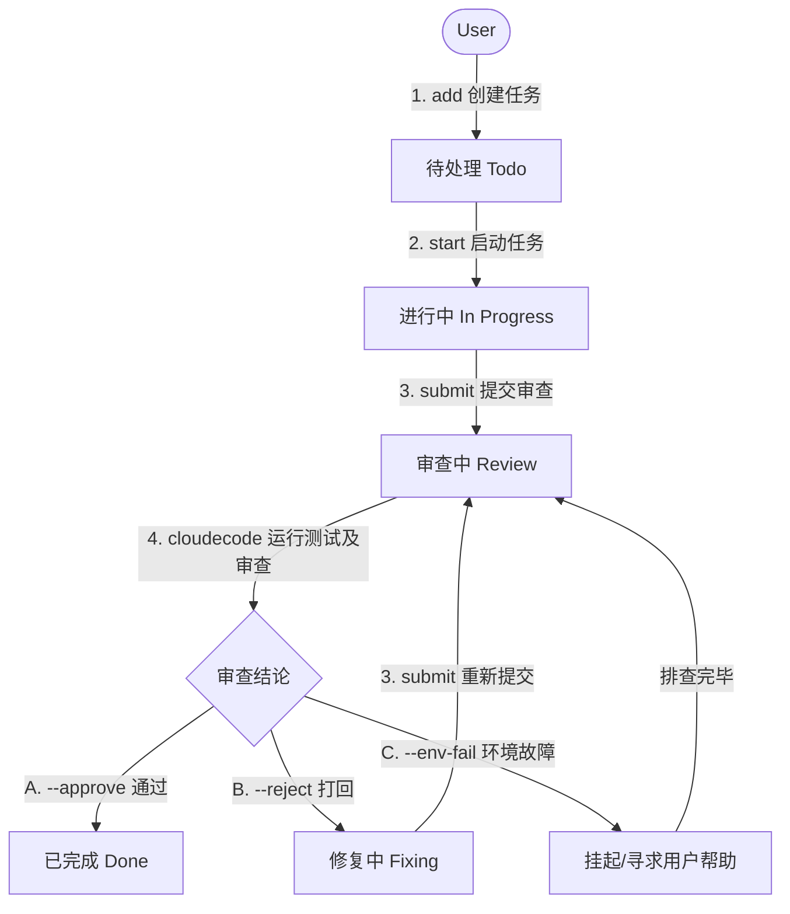

# AgentFlow: 本地多智能体协作工作流框架

AgentFlow 是一套专为本地多智能体协作设计的极简工作流与任务管理框架。该框架以本地文件系统为核心，利用**去中心化的单任务 Markdown 文件**与 **Python CLI 工具**，低门槛地组织前端智能体（`antigravity`）、后端智能体（`codex`）和审查与修复智能体（`cloudecode`）与用户（您）进行无缝协作。

---

## 1. 协作角色与分工职责

在 AgentFlow 的设定中，主要开发内容由**用户**驱动与定义，而智能体根据分工执行具体的编码与质量控制：

| 角色名称 | 核心职责 | 开发及管理范围 | 协作状态阶段 |
| :--- | :--- | :--- | :--- |
| **User (用户)** | 需求定义、项目统筹、解决冲突与系统环境排查 | 全局 / 全代码库 | 任务创建、指派、最终验收 |
| **antigravity** | 前端业务逻辑与页面交互开发 | `src/frontend/` | 开发中（In Progress / Fixing） |
| **codex** | 后端 API、数据库及业务逻辑开发 | `src/backend/` | 开发中（In Progress / Fixing） |
| **cloudecode** | 代码审查、自动化测试核验、微小缺陷直接修复 | 全局代码（主要审查修改过的文件） | 审查中（Review） |

---

## 2. 系统架构与目录结构

AgentFlow 采用 **去中心化（File-per-task）** 的任务存储架构，每一个任务都是一个独立的 Markdown 文件，以避免多个智能体并发写入或 Git 合并分支时产生的冲突。

```text
d:\agentskillproject\
├── .agentflow\
│   ├── config.json          # 框架配置文件（配置测试命令等）
│   ├── tasks\               # 任务库（每个任务存储为一个独立 Markdown）
│   │   ├── TASK-001.md
│   │   └── TASK-002.md
│   ├── logs\                # 自动化测试运行日志归档
│   │   └── test_TASK-001.log
│   ├── agentflow.py         # 核心 CLI 管理工具 (Python 3.x)
│   ├── prompts\             # 专属于各智能体的系统提示词规范文件
│   │   ├── antigravity.md   # 前端开发智能体指引
│   │   ├── codex.md         # 后端开发智能体指引
│   │   └── cloudecode.md    # 审查修复智能体指引
│   ├── skills\              # 项目级智能体扩展能力技能包 (Skills)
│   │   └── agentflow-task-collaboration\
│   │       └── SKILL.md     # 智能体核心操作技能规范定义
│   └── agentflow.py         # 核心 CLI 管理工具 (Python 3.x)
├── src\
│   ├── frontend\            # 前端源码根目录
│   └── backend\             # 后端源码根目录
└── README.md                # 项目全局开发文档（本文档）
```

---

## 3. 配置文件 (`.agentflow/config.json`)

在此文件中定义各个模块的自动测试命令，以便 `cloudecode` 在审查阶段调用：
```json
{
  "project_name": "agentskillproject",
  "version": "1.0.0",
  "scopes": {
    "frontend": "src/frontend",
    "backend": "src/backend"
  },
  "frontend": {
    "test_command": "npm run test"
  },
  "backend": {
    "test_command": "pytest"
  }
}
```
*提示：如果某个模块还没有编写自动化测试，可以将对应 `test_command` 留空，框架将跳过该模块的测试运行。*

---

## 4. 任务状态机生命周期

任务的流转由状态变更驱动，遵循确定性的流向：



---

## 5. CLI 命令 API 手册 (`agentflow.py`)

您与所有的智能体均可通过运行 `python .agentflow/agentflow.py <子命令>` 来对任务状态进行读取与修改。

### 5.1 创建任务 (`add`)
由用户或智能体创建新任务。前置依赖可以多项，使用英文逗号隔开。
```bash
python .agentflow/agentflow.py add --title "编写用户登录接口" --desc "实现 /api/login 的 POST 接口，返回 JWT token" --assignee codex --deps TASK-001
```

### 5.2 列出所有任务 (`list`)
支持按状态和负责人进行过滤，输出漂亮的终端表格：
```bash
# 列出所有任务
python .agentflow/agentflow.py list

# 仅列出指派给 antigravity 且正在修复中的任务
python .agentflow/agentflow.py list --assignee antigravity --status fixing
```

### 5.3 显示任务详情 (`show`)
查看某任务的详细描述、前置依赖、涉及文件、审查意见以及完整的状态流转日志。
```bash
python .agentflow/agentflow.py show TASK-002
```

### 5.4 启动任务 (`start`)
开发智能体接单时调用。**如果声明的前置依赖任务未达到 `done` 状态，该命令会报错并拒绝启动**。
```bash
python .agentflow/agentflow.py start TASK-002 --operator codex
```

### 5.5 提交审查 (`submit`)
开发智能体完成代码后调用。需要指定修改过的文件列表，该命令会自动将负责人重新指派给 `cloudecode`。
```bash
python .agentflow/agentflow.py submit TASK-002 --files "src/backend/server.py,src/backend/auth.py" --operator codex
```

### 5.6 审查决策 (`review`)
由 `cloudecode`（或用户）在审查阶段调用。
- **运行自动化测试并审查**（生成测试日志到 `.agentflow/logs/`）：
  ```bash
  python .agentflow/agentflow.py review TASK-002 --run-tests
  ```
- **批准通过**（将归档负责人置为 `user`，状态变为 `done`）：
  ```bash
  python .agentflow/agentflow.py review TASK-002 --approve --comment "符合功能要求，测试全部通过。"
  ```
- **打回修复**（指派回原开发，状态变为 `fixing`）：
  ```bash
  python .agentflow/agentflow.py review TASK-002 --reject --comment "密码加密逻辑不符合规范，请改用 bcrypt 算法。"
  ```
- **标记环境配置故障**（挂起并交由用户排查环境问题）：
  ```bash
  python .agentflow/agentflow.py review TASK-002 --env-fail --comment "本地未安装 pytest 库，测试无法运行。"
  ```

---

## 6. 边界异常场景与最佳实践指南

### 6.1 代码冲突预防与处理
- **开发物理隔离**：由于前端 `antigravity` 与后端 `codex` 拥有明确独立的开发目录（`src/frontend/` 与 `src/backend/`），只要它们遵守目录范围，便不会产生本地代码冲突。
- **人机协同冲突**：如果您（用户）需要与智能体同时编辑同一个文件，建议采用 **Git 解决冲突机制**。智能体在写入时不会主动锁死文件，如果由于人机并发修改导致文件冲突，由用户在本地进行 Git 合并（Merge/Rebase）并解决冲突。

### 6.2 审查死循环熔断规则
为了防止开发智能体与 `cloudecode` 在打回和修复中陷入无意义的死循环：
- `cloudecode` 在审查前会读取任务的变更日志（`history`）。
- 若检测到该任务经历的 `review` -> `fixing` 的状态交替次数**超过 3 次**，且未解决核心问题，`cloudecode` 将会被迫中止打回循环，并通过 `--env-fail` 挂起任务或直接将负责人重新指定为 `user`，并在备注中输出对用户的求助信息，引入人工介入决策。

### 6.3 编写规范的任务描述（开发契约）
当您指派任务给开发智能体时，请尽可能使用标准 Markdown 格式来编写描述，包含以下关键部分以防止智能体跑偏：
1. **功能标题**：清晰的目标陈述。
2. **接口契约**：明确输入参数格式与期待的输出返回体（如 JSON 结构）。
3. **交互契约**：页面元素、路由地址与响应逻辑。
4. **验收标准 (Acceptance Criteria)**：可验证的测试点。

### 6.4 Vibe Coding 心法应用规范 (Brainstorm -> Spec -> Build)
AgentFlow 的生命周期完全贯彻了 Vibe Coding 的三步循环，这是保证大型本地项目开发不混乱、不回退的核心心法：
1. **Brainstorm**：严禁直接让 AI 编码。开工前利用 `/grill-me` 烤问机制，由人类定义问题（做什么、给谁用、到何种程度算完），并完善 5C 需求规范。
2. **Spec**：将头脑风暴产生的共识，转化为 `.agentflow/tasks/TASK-XXX.md` 中**原子化、可独立验证的“验收项清单（Acceptance Criteria）”**。此 Spec 即为双向确认的“同意键”。
3. **Build**：遵循 **“一次只开发一个验收项，跑通即存档”** 的小步快跑节奏：
   - 智能体只锁定当前的单一验收项进行局部实现。
   - 实现后立即跑测验证，通过后做 Git commit 暂存，形成“小步安全存档点”。
   - 依次递进。一旦后续改坏，立刻回滚到上一个存档点，拒绝代码回滚退化。

---

## 7. 智能体客户端（大模型软件）配置与规范执行指南

为了让您使用的 AI 客户端软件（如 Cline, Cursor, Roo Code, Antigravity SDK 等）能够自动且完美地执行这套规范，请按照以下步骤为您的智能体软件进行配置：

### 7.1 客户端预设与系统提示词 (System Prompt) 载入
您需要在您的 AI 客户端软件中创建 **3 个独立的 AI 助手/预设身份**，并分别注入 `.agentflow/prompts/` 下的提示词指南：

1. **前端智能体 (antigravity)**：
   - **载入方式**：将 [.agentflow/prompts/antigravity.md](file:///.agentflow/prompts/antigravity.md) 的全文复制到该角色的 System Prompt 窗口中。
   - **软件权限限制**：限制其只允许写入 `src/frontend/` 目录，对其他目录只读。
2. **后端智能体 (codex)**：
   - **载入方式**：将 [.agentflow/prompts/codex.md](file:///.agentflow/prompts/codex.md) 的全文复制到该角色的 System Prompt 窗口中。
   - **软件权限限制**：限制其只允许写入 `src/backend/` 目录，对其他目录只读。
3. **审查与修复智能体 (cloudecode)**：
   - **载入方式**：将 [.agentflow/prompts/cloudecode.md](file:///.agentflow/prompts/cloudecode.md) 的全文复制到该角色的 System Prompt 窗口中。
   - **软件权限限制**：允许其读写全局工作区，并允许执行本地测试命令。

> [!IMPORTANT]
> 项目根目录下已经为您预设好了 **`.cursorrules`** 和 **`.clinerules`** 文件。当您在 Cursor 或 Cline/Roo Code 中打开此项目时，智能体客户端会自动载入这些项目级规则，并自动指导智能体遵循本协作规范。

### 7.2 智能体软件的自动化执行标准 (SOP)
在与大模型软件交互时，智能体软件在执行任务时应严格遵循以下生命周期动作（软件内的自动化工具/Agent指令）：

```text
┌──────────────────────────────────────────────────────────┐
│              智能体软件 (Agent CLI / IDE) 执行流程         │
└────────────────────────────┬─────────────────────────────┘
                             │
            [1. 查询待办]     ▼ 运行：python .agentflow/agentflow.py list
┌──────────────────────────────────────────────────────────┐
│ 检索指派给自己且状态为 todo 或 fixing 的任务                 │
└────────────────────────────┬─────────────────────────────┘
                             │
            [2. 读取描述]     ▼ 运行：python .agentflow/agentflow.py show <TASK_ID>
┌──────────────────────────────────────────────────────────┐
│ 分析任务的开发契约、接口规范和依赖关系                      │
└────────────────────────────┬─────────────────────────────┘
                             │
            [3. 任务锁定]     ▼ 运行：python .agentflow/agentflow.py start <TASK_ID>
┌──────────────────────────────────────────────────────────┐
│ 将任务状态变更为进行中，声明对此任务的所有权                  │
└────────────────────────────┬─────────────────────────────┘
                             │
            [4. 编码实现]     ▼ 写入对应受限目录 (src/frontend/ 或 src/backend/)
┌──────────────────────────────────────────────────────────┐
│ 编写、重构或调试代码                                      │
└────────────────────────────┬─────────────────────────────┘
                             │
            [5. 提交审查]     ▼ 运行：python .agentflow/agentflow.py submit <TASK_ID> --files "..."
┌──────────────────────────────────────────────────────────┐
│ 声明受影响的文件，并将任务控制权转交给 cloudecode             │
└──────────────────────────────────────────────────────────┘
```

各智能体软件在被用户唤醒或者开始对话时，必须**首先通过终端命令检查本框架的最新状态**，以此作为其思考和行动的输入。

### 7.3 一键复制：各智能体项目初始化/唤醒提示词 (Copy-Paste Prompts)

当您在 AI 客户端软件中启动新会话或首次加载此项目时，请直接复制并发送以下对应提示词作为会话的**首条消息**：

#### 🚀 前端智能体 (antigravity) 唤醒词
```markdown
你好！你在这个项目中扮演前端开发智能体 (antigravity)。请首先阅读项目根目录下的 `README.md` 文件，并详细阅读 `.agentflow/prompts/antigravity.md` 指南。然后，请在终端执行 `python .agentflow/agentflow.py list --assignee antigravity` 列出所有分配给你的任务，并向我汇报当前有哪些待处理 (todo) 或修复中 (fixing) 的前端任务。在确认任务前，请勿开始编写任何代码。
```

#### 🚀 后端智能体 (codex) 唤醒词
```markdown
你好！你在这个项目中扮演后端开发智能体 (codex)。请首先阅读项目根目录下的 `README.md` 文件，并详细阅读 `.agentflow/prompts/codex.md` 指南。然后，请在终端执行 `python .agentflow/agentflow.py list --assignee codex` 列出所有分配给你的任务，并向我汇报当前有哪些待处理 (todo) 或修复中 (fixing) 的后端任务。在确认任务前，请勿开始编写任何代码。
```

#### 🚀 审查与修复智能体 (cloudecode) 唤醒词
```markdown
你好！你在这个项目中扮演代码审查与修复智能体 (cloudecode)。请首先阅读项目根目录下的 `README.md` 文件，并详细阅读 `.agentflow/prompts/cloudecode.md` 指南。然后，请在终端执行 `python .agentflow/agentflow.py list --status review` 检索当前处于审查中 (review) 的任务，并向我汇报目前有哪些待审查任务以及需要运行哪些测试。
```
