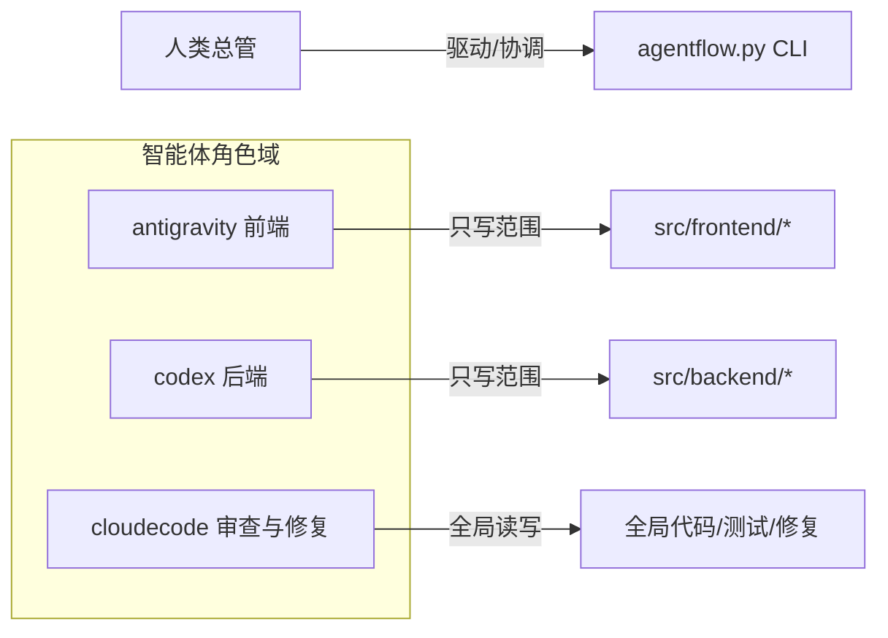
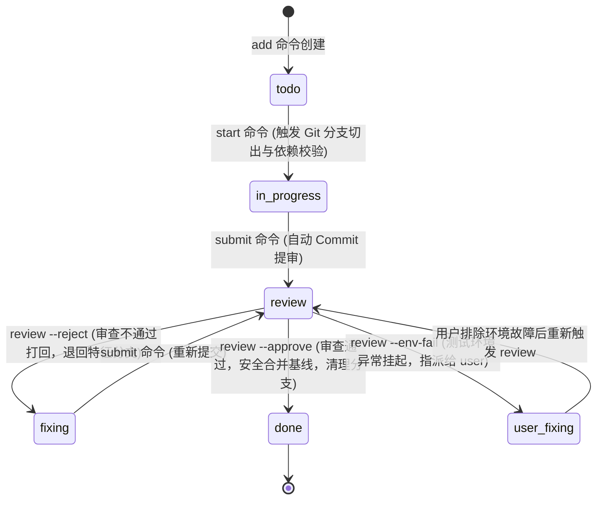

# AgentFlow 多智能体本地协同工作流详解手册

本手册详细记录了 **AgentFlow** 协同框架的核心设计架构、状态机模型、Git 分支自动化、多级卡关门禁、日常交互 SOP 以及边缘异常处理机制。

---

## 一、 系统架构与角色隔离

为了防止多智能体在本地开发时产生代码覆盖和并发冲突，AgentFlow 确立了严格的**物理边界与职责边界**隔离：



### 1. 角色范围对照表

| 角色名称 | 核心定位 | 写入目录范围 | 读取目录范围 | 核心流转指令 |
| :--- | :--- | :--- | :--- | :--- |
| **antigravity** | 前端开发智能体 | `src/frontend/` | 全局项目范围 | `start`, `submit` |
| **codex** | 后端开发智能体 | `src/backend/` | 全局项目范围 | `start`, `submit` |
| **cloudecode** | 代码审查与修复智能体 | 全局（仅限微调/测试） | 全局项目范围 | `review --approve`, `review --reject`, `review --env-fail` |

> [!WARNING]
> - `antigravity` 严禁修改任何 `src/backend/` 下的文件。
> - `codex` 严禁修改任何 `src/frontend/` 下的文件。
> - 项目级规则 `.cursorrules` 与 `.clinerules` 会自动注入并强制在 AI 客户端中约束以上行为。

---

## 二、 任务管理：去中心化 Markdown 任务卡片

AgentFlow 采用去中心化、对 Git 友好的单任务单文件方案。每个任务均由独立的 Markdown 文件管理：
- **存储路径**：`.agentflow/tasks/TASK-XXX.md`（支持在子目录下分类，如 `tasks/auth/TASK-001.md`）。
- **元数据嵌入**：使用隐藏的 HTML 注释 `<!-- agentflow {json} -->` 作为卡片 Frontmatter，保留机器解析的结构化属性，底部为人类可读的任务状态变更历史。

### 任务卡片核心格式示例
```markdown
<!-- agentflow
{
  "id": "TASK-006",
  "title": "添加登录后端接口",
  "assignee": "codex",
  "status": "fixing",
  "dependencies": ["TASK-001"],
  "affected_files": [
    "src/backend/login.py",
    "src/backend/login_test.py"
  ],
  "comments": [
    {
      "time": "2026-06-01T01:50:24",
      "author": "cloudecode",
      "comment": "单元测试未通过：登录返回格式不符合规范"
    }
  ],
  "history": [ ... ]
}
-->

# TASK-006: 添加登录后端接口

## 任务描述
实现后端登录 API 与配套单元测试。

## 涉及文件
- `src/backend/login.py`
- `src/backend/login_test.py`

## 审查意见与修复记录
- **cloudecode** (2026-06-01T01:50):
    单元测试未通过：登录返回格式不符合规范
```

---

## 三、 状态机生命周期模型

所有任务在开发流中遵循严格的单向或双向状态迁移规则：



---

## 四、 本地 Git 分支自动化管理机制

AgentFlow 内置了强大的 Git 分支流转逻辑，能以无侵入的方式自动保持仓库整洁：

### 1. `start` 动作：分支切出
运行 `python .agentflow/agentflow.py start TASK-XXX` 时：
- 检测是否处于 Git 工作区。
- 自动提取任务 ID，将其转为全小写，创建并切换至对应特征分支 `feature/task-xxx`：
  ```bash
  git checkout -b feature/task-xxx
  ```
- 如果分支在本地已经存在（代表之前被打回重新开发），则直接切换：
  ```bash
  git checkout feature/task-xxx
  ```

### 2. `submit` 动作：阶段式自动提交
运行 `python .agentflow/agentflow.py submit TASK-XXX` 时：
- 校验当前所在分支是否与特征分支 `feature/task-xxx` 一致。
- 自动执行物理文件暂存与本地 Commit，以保证代码不遗失在工作区中：
  ```bash
  git add .
  git commit -m "feat: implement TASK-XXX code"
  ```
- 自动更新任务状态为 `review` 并将指派人移交为 `cloudecode`。

### 3. `review --approve` 动作：安全合并与清理
代码审查通过后：
- 首先保存状态变更历史（将 `status` 变更为 `done`）至本地 `.md` 文件，并在特征分支下执行最后一次自动 Commit：
  ```bash
  git add .
  git commit -m "chore: review TASK-XXX state to done"
  ```
- 获取主线基线分支名（顺序检测 `master` -> `main` -> `dev`）。
- 安全切回到主线基线分支：
  ```bash
  git checkout master
  ```
- 自动对特征分支执行 `--no-ff`（非快进式）安全合并，保留清晰的分支合并图谱：
  ```bash
  git merge feature/task-xxx --no-ff -m "Merge branch 'feature/task-xxx' into master"
  ```
- 自动在本地物理清理已合并的特征分支：
  ```bash
  git branch -d feature/task-xxx
  ```

---

## 五、 本地质量门禁三阶段卡关

审查智能体 `cloudecode` 通过配置文件 `.agentflow/config.json` 获取针对对应开发角色的检验命令：

### 1. 质量门禁配置结构
```json
{
  "backend": {
    "lint_command": "python -m py_compile src/backend/login.py",
    "test_command": "python src/backend/login_test.py"
  }
}
```

### 2. 三阶段串行检验机制
当运行 `review TASK-XXX --run-tests` 时，系统将按顺序调度执行：
1. **代码风格检查 (Linting)**：运行风格/静态分析命令，失败则中断。
2. **静态类型检查 (Type Check)**：运行类型推导命令，失败则中断。
3. **单元测试 (Unit Tests)**：运行单元测试命令，失败则中断。

### 3. 日志归档与审查分流
所有测试控制台输出（STDOUT 与 STDERR）以及退出码均自动重定向并归档到 `.agentflow/logs/test_TASK-XXX.log`。
- **若测试全部通过 (Exit Code 0)**：`cloudecode` 可顺利审批通过。
- **若因代码缺陷失败 (Exit Code != 0)**：`cloudecode` 自动触发 `review --reject` 并提供详细调用栈。
- **若因本地环境故障失败（如缺少包、接口冲突）**：`cloudecode` 执行 `review --env-fail` 挂起任务，防止无效的代码修复循环。

---

## 六、 边缘与容错机制处理

框架设计深度考虑了各种协作边缘情况：

- **依赖死锁保护**：启动任务前，CLI 会递归校验 `dependencies` 列表中的每个任务状态是否为 `done`。一旦发现前置任务不满足，强行阻断启动，保护生命周期的依赖关系。
- **工作区冲突预防**：在执行 `git checkout` 之前，CLI 会强制对当前 `.md` 任务状态卡片进行保存与本地 Commit，彻底杜绝因为“工作区存在未暂存的修改”而导致 checkout 失败的异常。
- **去中心化防冲突**：由于每个任务都是单独的 `.md` 卡片，Git 合并时仅会产生分支合并的图形记录，各任务状态元数据不会发生 Git 冲突，消除了协作盲区。
