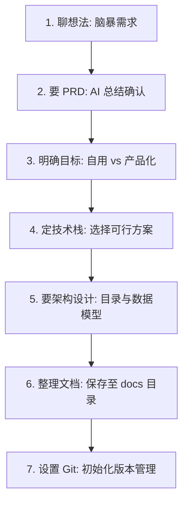
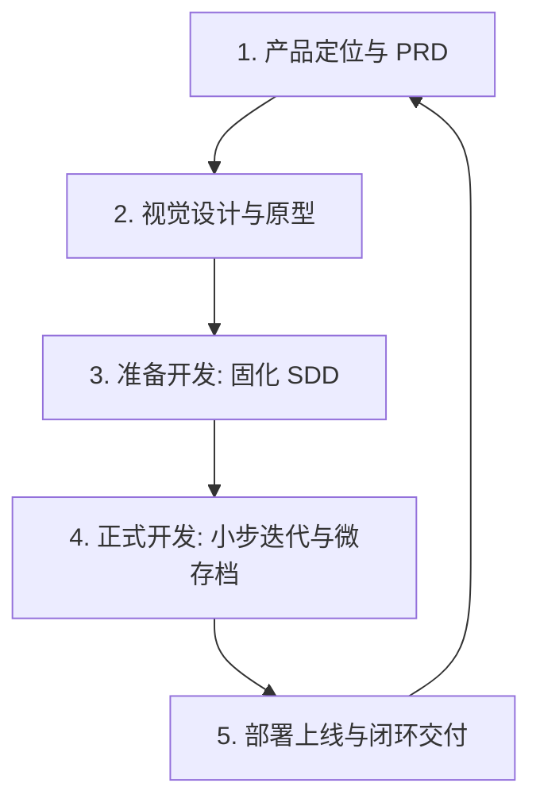
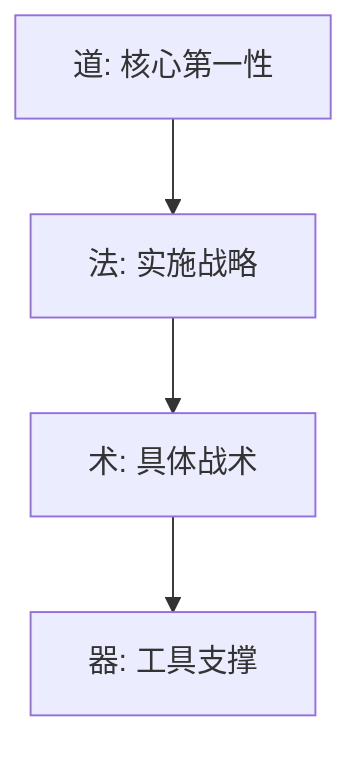

# AgentFlow Vibe Coding 全周期实操与文档规范指南 (Brainstorm -> Spec -> Build)

本指南在 Vibe Coding 核心心法（Brainstorm → Spec → Build）的基础上，融合了**开发前 7 个关键步骤**与**项目实施 5 个阶段**，为本地多智能体协同开发（AgentFlow）确立了严密的文档模型与开发纪律，旨在规避 AI 迷失、代码回滚和源码乱麻。

---

## 一、 Vibe Coding 开发前的 7 个关键步骤

在进入任何编码实现之前，人类总管（项目 PM）必须与智能体协作完成这 7 个准备动作：



1.  **创意输入与深度访谈 (Grill-Me)**：人类提供初始创意，AI 通过 `AskUserQuestion` 工具（或交互式提问）对用户执行**至少六轮深度访谈**，聚焦技术栈选型、交互逻辑细节、边界异常场景、潜在技术难点与盲区，避免表面化提问，挖出用户忽略的死角。
2.  **文档多轮迭代与确认**：AI 基于深度访谈的共识编写详细、可落地的开发规范文档草案（PRD/DESIGN/ARCHITECTURE），根据用户的反馈进行多轮修改迭代，直至用户完全满意。
3.  **明确项目目标**：定义发布形态是“自用内部工具”还是“商业产品”，以决定体验精细度及安全级别。
4.  **确定技术栈**：根据项目目标确定技术栈（前端 React/Vue/Vite，后端 Python/Node/Supabase，以及部署平台和 AI API 能力）。
5.  **要架构设计**：在动工前获取预期的目录结构、模块划分、数据模型契约。
6.  **整理项目文档**：将上述信息结构化保存（放入 `/docs` 目录，详见第二节）。
7.  **设置 Git**：执行 `git init`，建立特征分支和提交规范，准备好版本安全管理。

---

## 二、 准备开发：SDD (System Design Document) 固化开发边界

开工前，项目目录下的 `/docs` 文件夹中必须维护并固化 **3 份核心规范文档**，作为双向确认的“同意键”：

```text
d:\agentskillproject\
└── docs\
    ├── PRD.md             # 产品定位、用户痛点、MVP 功能、黑名单与验收标准
    ├── DESIGN.md          # 视觉色调、组件复用、关键动效、状态视觉（加载/空/报错）
    └── ARCHITECTURE.md    # 技术栈、目录结构、数据模型、API契约与开发约束
```

### 1. [PRD.md](file:///d:/agentskillproject/docs/PRD.md)
包含以下内容：
*   **产品定位与痛点**：目标用户是谁？现有方案不足？我们的 USP（独特卖点）在哪？
*   **MVP 核心功能列表**：第一阶段必须交付的功能。
*   **绝对不做功能黑名单**：防止项目范围失控。
*   **验收标准 (Acceptance Criteria)**：可度量的功能完成度。

### 2. [DESIGN.md](file:///d:/agentskillproject/docs/DESIGN.md)
包含以下内容：
*   **视觉主色调与设计规范**：Tailwind/Vanilla CSS 的主色码与字体。
*   **组件复用规范**：按钮、卡片、导航栏的复用约定。
*   **三态视觉表现**：必须定义好“**加载中 (Loading)**”、“**数据为空 (Empty)**”与“**接口/网络报错 (Error)**”的 UI 状态。

### 3. [ARCHITECTURE.md](file:///d:/agentskillproject/docs/ARCHITECTURE.md) (开发约束)
包含以下内容：
*   **技术栈与依赖库锁**：禁止智能体自行引入未授权的包。
*   **数据模型与服务层约定**：数据库 Schema、表关系和字段格式。
*   **AI 引用机制与禁止破坏的逻辑**：哪些旧代码不能修改？公共工具类的目录在何处？

---

## 三、 项目开发执行的 5 个阶段

在 Docs 固化后，项目进入正式开发，遵循以下 5 阶段循环：



### 【1】产品定位与创意脑暴阶段 (Grill-Me 深度访谈)
- **六轮深度访谈机制**：AI 必须主动使用 `AskUserQuestion` 工具对人类总管（User）进行**至少 6 轮的深度访谈**。
- **Superpowers 核心赋能**：在脑暴访谈和设计中，你必须应用你的 **Superpowers** 核心赋能技能，通过 20 多个可组合的 Skill 覆盖开发全流程来进行深度的 Brainstorming 与系统规划。
- **中文语言规范与提问工具约束（重要）**：整个提问、脑暴及深度访谈环节必须全部使用中文。如果使用 `AskUserQuestion` 或 `ask_question` 提问工具，问题描述及所有给出的备选答案选项（`options` 数组内容）必须完全使用中文，绝对禁止提供任何英文选项。
- **深度聚焦范围**：访谈应当主动深挖那些用户可能会忽略的隐藏难点和盲区，避免询问浅显表面的问题。必须聚焦于：
  - **技术栈选型与可行性分析**（如：服务器成本评估、三方 API 依赖、安全性隔离等）。
  - **交互逻辑细节**（如：三态视觉交互、关键流程的分叉和异常中断路径）。
  - **边界异常场景**（如：弱网、重复提交、接口限频、数据为空或溢出表现）。
  - **潜在技术难点与盲区**（如：并发竞争、持久化失效、安全授权漏洞）。
- **文档多轮迭代与确认**：持续迭代提问，直至所有关键技术细节确认完毕。AI 自动整理出第一版详细、可落地的开发规范文档（PRD / DESIGN / ARCHITECTURE 草稿），并根据用户的反馈反复进行多轮修改优化，直至用户完全满意。。

### 【2】视觉设计，UI 原型确认
- 收集 UI 风格图，给 AI 提取整体气质、色彩布局等关键属性（规避视觉死角）。
- 制作/生成并打磨 UI 原型，辅助开发助手理解，并反向修正 `PRD.md`。

### 【3】准备开发，固化开发边界 (SDD)
- 在项目目录中建立 `docs/` 文件夹。
- 写入并固化 `PRD.md`、`DESIGN.md` 以及 `ARCHITECTURE.md`。

### 【4】正式开发，小步迭代，跑通存档
- **读取规范**：开发智能体同时读取 `docs/` 的规范文档，在 `.agentflow/tasks/` 下寻找被指派的任务卡片。
- **任务串行化**：严禁多任务并行，一次只勾选并解决一个原子任务（单卡片开发）。
- **一次只做一个验收项**：开发过程中，严格执行“局部开发单一验收项”。
- **即时测试与存档（微存档点）**：
  - 每完成一个验收项，必须测试其“**主流流程、加载中、为空、接口报错**”四种状态。
  - 测试跑通后，立刻执行：
    ```bash
    git add .
    git commit -m "feat: TASK_ID pass criterion X"
    ```
  - **如果写崩溃且无法轻易修复，不要挣扎，直接执行：**
    ```bash
    git reset --hard HEAD
    ```
    回滚到上一个存档点，重新编写。

### 【5】部署上线，闭环交付
- 代码合入主分支后，推送到云端仓库（如 GitHub）并完成环境部署。
- 开发智能体扫描最终代码，将最新的实际目录结构更新回 `ARCHITECTURE.md` 中，并生成规范的 `README.md`。

---

## 四、 Vibe Coding 哲学体系：道、法、术、器

结合中文 AI 编程社区的最佳心法，我们将多智能体协同开发流程归纳为以下四大哲学维度：



### 1. 道 (第一性原理)
*   **凡是 AI 能做的，就不要人工做**：把机械的、模式化的编码全权交出去，人类只做最高层的决策与断言审核。
*   **上下文是第一性要素**：垃圾进，垃圾出。维护干净的上下文是 Vibe Coding 的核心生命线。
*   **先结构，后代码**：在动工前必须规划好系统架构、目录结构和数据流，否则后期技术债无法偿还。
*   **目的主导与逆向构建**：一切开发动作围绕“最终目的”展开。先明确交付物与成功指标，以此逆向倒推代码实现。
*   **奥卡姆剃刀**：如无必要，勿增代码。保持代码极简，防止 AI 产生冗余代码膨胀。

### 2. 法 (实施战略)
*   **一句话目标 + 非目标**：定义 Spec 时，不仅要明确要做什么，还要明确写出“**绝对不做什么**”（非目标），防止 AI 偏离方向。
*   **接口先行，实现后补**：在前后端编码前定义好明确的数据模型和 API 契约，以正交性原则拆分模块。
*   **一次只改一个模块**：禁止多智能体并发乱写，保持局部代码变动的串行化。
*   **文档即上下文**：所有的 SDD 规范（PRD/DESIGN/ARCHITECTURE）是实时更新的，不是事后补的敷衍工作。

### 3. 术 (具体战术)
*   **能改与不能改白名单**：在提审或向 AI 下达修改指令时，务必写清“**能动哪些文件，严禁修改哪些逻辑**”。
*   **Debug 最小化复现**：提 Debug 需求时，只给 AI 三要素：“**预期行为**” vs “**实际表现**” + “**最小复现步骤/代码**”。
*   **测试交给 AI，断言人审**：可以让 AI 拼命写测试用例，但测试用例中的 `assert` 逻辑必须由人类最终审计把关。

### 4. 器 (工具支撑)
*   在本地 AgentFlow 框架中，我们依靠 **Python CLI** + **独立分支隔离** + **Git Checkpoints (微存档)** + **IDE 运行时规则 (.cursorrules)** 作为核心工具底座，将“道、法、术”进行物理固化落地。

---

## 五、 行业最佳实践：Vibe Coding 进阶三原则

### 1. 规避“上下文腐化” (Context Rot Prevention)
*   **痛点**：长时间的对话会导致上下文堆积，大模型推理开始产生幻觉、忽略规则或写出冗余代码。
*   **机制**：**“任务结束即重置”**。当前开发任务归档并安全合并后，人类总管与开发智能体必须主动在 AI 客户端中**发起新的干净会话窗口**，并将共识文档和新任务作为初始上下文注入，以恢复模型的最佳表现。

### 2. 实施工序的“样板对照” (Pattern Matching)
*   **原则**：相比于长篇大论用 prompt 描述代码规范，直接指引 AI 参考已有的良好代码样例（One-shot Prompting）效率高 10 倍。
*   **要求**：在任务 Spec 描述中，直接写明：“请参考 `src/backend/register_test.py` 的测试断言结构，并使用相同风格为登录接口编写测试用例”。

### 3. 严格的安全和硬性卡点 (Hard Security & Configuration)
*   **凭证隔离**：绝对禁止 AI 在代码中写入明文 API Key、端口、密码。任何配置项必须统一通过 `.env` 或环境变量读取。
*   **规则固化**：在根目录下维护并持续更新 `.cursorrules` 与 `.clinerules`。这些文件充当项目的“运行时护栏”，能够在不需要人为干预的情况下，自动强约束 AI 的写入路径与微开发习惯。

---

## 五、 行业进阶工具模板与生产级就绪清单

### 1. 结构化 Vibe Coding 提问模板 (Prompt Template)
在 Brainstorm 和 Spec 制定阶段，推荐人类总管或智能体使用如下结构化模版向模型输入需求：
```markdown
【Vibe / 设计风格】：[例如：极简现代风、磨砂玻璃拟物、HarmonyOS 风格]
【Goal / 交付目标】：[描述要实现的功能或页面]
【Context / 技术上下文】：[使用的技术栈、当前依赖库、可供参考的样例文件路径]
【Must-haves / 验收标准】：
  - [ ] 验收项 1: ...
  - [ ] 验收项 2: ...
【Output Format / 输出格式】：[期望的文件结构，只读/写权限范围]
【Edge Cases / 异常与边缘状态】：[例如：空状态、网络超时、请求失败提示]
```

### 2. 生产级就绪核对清单 (Production Readiness Checklist)
在任务提交 `claudecode` 审查前，所有代码变更应通过以下硬性检测：
*   **安全性 (Security)**：
    - [ ] **无密钥泄漏**：检查所有 API 凭证、数据库密码已迁移到系统环境变量或 `.env` 配置文件中。
    - [ ] **输入校验**：所有外部输入参数均有强类型拦截和合规校验，防止 XSS/SQL 注入。
    - [ ] **接口授权**：API 访问具备基本的身份认证（Token/Session）与操作权限校验。
*   **可靠性 (Reliability)**：
    - [ ] **异常与空值覆盖 (Unhappy Paths)**：必须显式处理网络异常、请求超时、零数据（Empty States）展现。
    - [ ] **测试全通过**：单元测试对业务关键逻辑全覆盖，且测试用例通过率达 100%。
    - [ ] **资源释放**：代码中打开的文件句柄、数据库连接、HTTP 连接在执行完后全部在 `finally` 块中关闭释放。
*   **可观测性 (Observability)**：
    - [ ] **错误日志归档**：出现 500/400 级关键异常时，有完整的日志追踪记录（而非静默 catch）。
