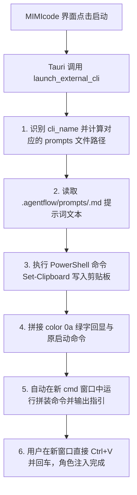

# MIMIcode 与 AgentFlow 启动注入集成设计文档

本文档定义了将 AgentFlow 本地智能体协作框架的专属提示词（prompts）与 MIMIcode Studio 桌面软件进行深度启动注入集成的方案。

## 1. 目标与非目标

### 目标 (Goals)
- 实现当用户在 MIMIcode 面板中“启动”任何外部智能体 CLI（如 Claude Code, Gemini CLI, OpenCode 等）时，系统自动将该角色的专属提示词（读取自 `.agentflow/prompts/<role>.md`）注入至系统剪贴板。
- 重构 Rust 后端的 `launch_external_cli` 接口，在新拉起的外部控制台终端中自动打印绿色指引通知，引导用户通过简单的 `Ctrl+V` 与 `Enter` 在启动之初注入扮演角色的系统规程。
- 确保在注入中不创建任何不必要的本地 `.md` 文件以防污染用户的项目工作区。

### 非目标 (Non-Goals)
- 本设计不对大模型 CLI 客户端的内部协议和交互引擎进行修改，也不干预外部 CLI 的内部运行生命周期，专注于“拉起-回显指引-提示词注入”的控制流集成。

## 2. 系统流向设计

## 3. 核心重构组件与实现细节

### 3.1 剪贴板自动写入 (`src-tauri/src/lib.rs` - `inject_prompt_to_clipboard`)
- 新增辅助函数 `inject_prompt_to_clipboard(project_path: &str, cli_name: &str)`。
- 通过 cli_name 映射：
  - `"claude"` -> `"claudecode.md"`
  - `"gemini"` -> `"antigravity.md"`
  - `"codex"` -> `"codex.md"`
  - `"opencode"` -> `"opencode.md"`
  - `"hermes_agent"` & `"hermes_dashboard"` -> `"hermes.md"`
- 拼接绝对文件路径并读取其内容。若文件不存在或读取失败，则静默忽略。
- 借助 PowerShell 执行 Windows 级原生的 `Get-Content -Raw '<path>' | Set-Clipboard` 命令，完成高稳定性复制，绝无命令行参数转义和超长限制问题。

### 3.2 启动命令拼接与回显 (`src-tauri/src/lib.rs` - `launch_external_cli`)
- 对 `launch_external_cli` 中所有的启动分支（claude, codex, gemini, opencode, hermes_agent, hermes_dashboard）进行命令级联拼装。
- 先调用 `color 0a` 切换到高亮绿色控制台界面，然后使用级联的 `echo` 命令显示专属提示词已被自动写入系统剪贴板的通知，并展示引导行。
- 最终在新窗口运行对应 CLI 工具。

## 4. 验证计划

1. **编译检查**：
   - 使用 `cargo check` 或 `npm run tauri build` 编译项目，确保 Rust 后端无编译级报错。
2. **功能集成测试**：
   - 打开 MIMIcode 客户端，在 Agents 面板分别启动“Claude Code”与“Antigravity”。
   - 验证是否弹出了绿色的命令行窗口，并且首屏清晰显示提示词已被复制至剪贴板的指引。
   - 在新弹出的控制台窗口中按 `Ctrl+V` 粘贴，验证内容是否与 `.agentflow/prompts` 下对应的智能体 md 提示词规程完全一致。
