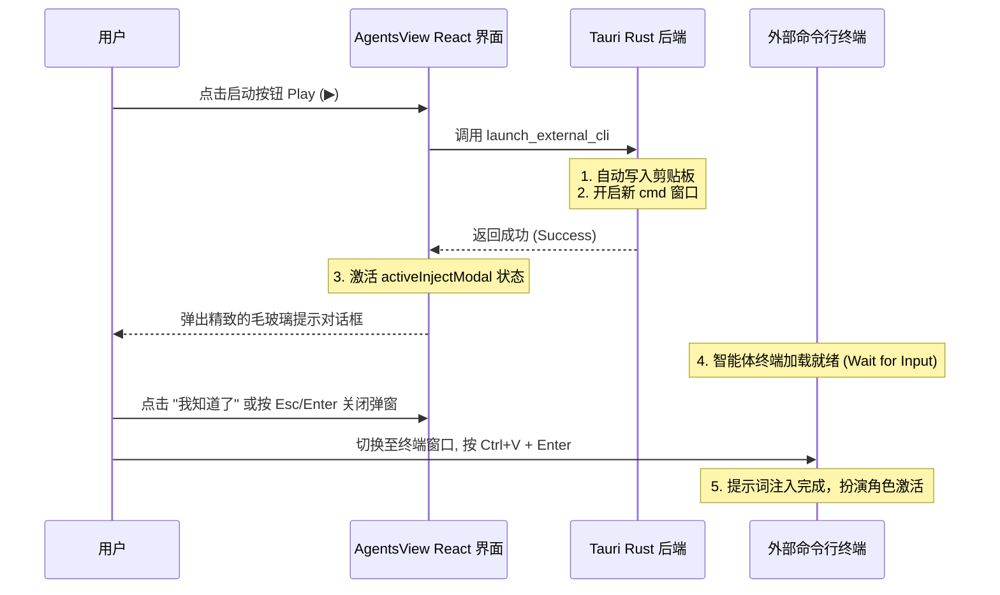

# MIMIcode 前端智能体激活提示弹窗设计文档

本文档定义了在 MIMIcode Studio 图形界面中新增“智能体激活提示弹窗”的设计，以协助用户在智能体 CLI 启动后将已复制到剪贴板的专属提示词准确注入终端。

## 1. 目标与非目标

### 目标 (Goals)
- 在 `AgentsView.tsx` 中实现一个美观的模态对话框（Modal），当 Agent CLI 成功拉起后自动弹出。
- 弹窗应具备高端的前端视觉质感，包括毛玻璃背景（Glassmorphism）、动态指引图标，以及直观的 `Ctrl+V` 与 `Enter` 组合操作说明。
- 支持快捷键（如 `Esc`、`Enter`）或点击“我知道了”关闭弹窗，确保操作流顺畅无阻。

### 非目标 (Non-Goals)
- 本次修改不增加任何新的路由或重构原有的配置持久化机制，专注于 AgentsView 视图层的交互微调。

## 2. 页面交互与状态流



## 3. 前端 UI 组件设计与 CSS 样式

### 3.1 弹窗状态管理 (`AgentsView.tsx`)
- 新增状态 `const [injectModalAgent, setInjectModalAgent] = useState<AgentConfig | null>(null);`。
- 当 `handleLaunch(agent)` 成功时，设置 `setInjectModalAgent(agent);` 触发弹窗显示。

### 3.2 UI 结构设计
```tsx
{injectModalAgent && (
  <div className="modal-overlay" ...>
    <div className="inject-modal-card" ...>
      <div className="inject-modal-icon-wrapper">
        <Icons.CheckCircle className="inject-success-icon" />
      </div>
      <h2>智能体已就绪 (Agent Ready)</h2>
      <p>
        系统已自动将 <strong>{injectModalAgent.name}</strong> 的专属提示词复制到您的剪贴板。
      </p>
      <div className="action-hint-box">
        请在刚刚弹出的终端窗口中，直接按下 <kbd>Ctrl</kbd> + <kbd>V</kbd> 粘贴并按回车以注入系统规程。
      </div>
      <button onClick={() => setInjectModalAgent(null)}>我知道了</button>
    </div>
  </div>
)}
```

### 3.3 样式系统对接 (`src/App.css`)
- 注入专属 CSS 变量和类，包括 `.inject-modal-card` 的背景渐变阴影，按钮 hover 微交互，以及 `<kbd>` 快捷键键盘风格样式。

## 4. 验证计划

1. **构建与运行测试**：
   - 运行前端编译，验证是否存在变量绑定错误。
2. **端到端功能验证**：
   - 在 MIMIcode 面板点击启动任意 Agent (如 Antigravity)。
   - 检查界面正中是否顺利弹出了精美的 Modal。
   - 确认在 Modal 弹出后，剪贴板里是否已经是该 Agent 的提示词（尝试在其他地方粘贴确认）。
   - 按下 Enter 键或点击按钮，验证 Modal 能否正常关闭。
