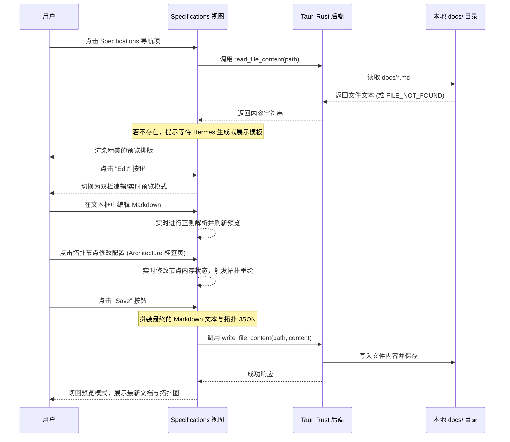

# MIMIcode Specifications 视图双向读写与交互式设计文档

本文档定义了在 MIMIcode Studio 中完善 "Specifications" 模块（包含 PRD、Design、Architecture、API Contracts 标签页）的设计方案。此方案将彻底告别静态 Mockup，实现前台界面与物理 Markdown 文件（`docs/` 目录）的动态双向同步，并为系统架构引入交互式拓扑编辑器。

## 1. 目标与非目标

### 目标 (Goals)
- **动态加载与渲染**：动态读取项目路径下 `docs/` 内的 `PRD.md`、`DESIGN.md`，`ARCHITECTURE.md` 与 `API_CONTRACTS.md`，并在界面中解析为排版精美的 HTML。
- **双栏 Markdown 编辑器**：支持 "Edit" 模式，进入左侧编辑源码、右侧实时预览的双栏所见即所得交互，保存时自动回写本地文件。
- **交互式架构拓扑设计**：在 Architecture 页中，拓扑图读取并编辑 `ARCHITECTURE.md` 底部嵌入的 `<!-- architecture_diagram {json} -->` 数据，实现图形化编辑技术栈与节点，并自动回写同步。
- **无感延迟体验**：在 Tauri (Rust) 层实现极其轻量、安全的文件读写指令，无多进程拉起时延。

### 非目标 (Non-Goals)
- 本次修改不引入外部的大型 Markdown 渲染依赖（如 `react-markdown` 等），通过前端自研的高性能正则 Markdown 编译器实现，保证轻量。
- 不增加多分支冲突解决效果的 UI 交互，默认由开发智能体在 start/submit 流程中处理 Git 冲突。

## 2. 页面交互与状态流



## 3. 技术方案与实现细节

### 3.1 Tauri 后端 API (Rust)
在 `src-tauri/src/lib.rs` 中新增并注册以下两个通用命令：

```rust
#[tauri::command]
fn read_file_content(path: String) -> Result<String, String> {
    let p = std::path::Path::new(&path);
    if !p.exists() {
        return Ok("FILE_NOT_FOUND".to_string());
    }
    std::fs::read_to_string(p).map_err(|e| e.to_string())
}

#[tauri::command]
fn write_file_content(path: String, content: String) -> Result<(), String> {
    let p = std::path::Path::new(&path);
    if let Some(parent) = p.parent() {
        std::fs::create_dir_all(parent).map_err(|e| e.to_string())?;
    }
    std::fs::write(p, content).map_err(|e| e.to_string())
}
```

### 3.2 极简 Markdown 编译器 (前端)
在 `SpecificationsView.tsx` 中编写一个渲染解析器：

```typescript
const parseMarkdown = (md: string): string => {
  if (!md) return '';
  // 过滤掉嵌入的架构图注释，防止混入预览
  let html = md.replace(/<!--\s*architecture_diagram[\s\S]*?-->/g, '');
  
  // 基础 Markdown 元素转 HTML
  html = html
    // 标题
    .replace(/^# (.*?)$/gm, '<h1 class="markdown-h1">$1</h1>')
    .replace(/^## (.*?)$/gm, '<h2 class="markdown-h2">$2</h2>')
    .replace(/^### (.*?)$/gm, '<h3 class="markdown-h3">$1</h3>')
    // 任务列表
    .replace(/^- \[ \] (.*?)$/gm, '<div class="markdown-todo"><input type="checkbox" disabled /> <span>$1</span></div>')
    .replace(/^- \[x\] (.*?)$/gm, '<div class="markdown-todo completed"><input type="checkbox" checked disabled /> <span>$1</span></div>')
    // 无序列表
    .replace(/^- (.*?)$/gm, '<li class="markdown-li">$1</li>')
    // 粗体与斜体
    .replace(/\*\*(.*?)\*\*/g, '<strong>$1</strong>')
    .replace(/\*(.*?)\*/g, '<em>$1</em>')
    // 行内代码
    .replace(/`(.*?)`/g, '<code class="markdown-code">$1</code>')
    // 代码块
    .replace(/```(.*?)\n([\s\S]*?)```/g, '<pre class="markdown-pre"><code class="language-$1">$2</code></pre>')
    // 链接
    .replace(/\[(.*?)\]\((.*?)\)/g, '<a href="$2" target="_blank" class="markdown-link">$1</a>')
    // 段落
    .split('\n\n')
    .map(p => p.trim() && !p.startsWith('<') ? `<p class="markdown-p">${p}</p>` : p)
    .join('\n\n');

  return html;
};
```

### 3.3 架构图数据结构与嵌入式保存
嵌入数据格式：
```html
<!-- architecture_diagram
{
  "nodes": [
    { "id": "fe", "title": "Frontend", "subtitle": "React 18", "type": "frontend" },
    ...
  ]
}
-->
```

前端提取函数：
```typescript
const extractDiagramData = (content: string) => {
  const match = content.match(/<!--\s*architecture_diagram\s*\n([\s\S]*?)\n-->/);
  if (match) {
    try {
      return JSON.parse(match[1]);
    } catch (e) {
      console.error("Failed to parse architecture json metadata", e);
    }
  }
  return null;
};
```

#### 架构节点编辑器弹窗
点击架构图中的任何节点时，弹出 `EditNodeModal`：
- 输入框修改 `title` 与 `subtitle`
- 下拉选择 `type` (决定渲染风格)
- 支持对节点添加或删除。确认后触发 state 更新并重绘，保存时回写。

## 4. 验证计划

1. **基本验证**：
   - 验证编译有无语法错误，Tauri 能否正常挂载命令。
2. **多标签页双向联调测试**：
   - 在 `d:\agentcode\docs` 目录下分别写入测试文件，验证前端页面能否正常加载。
   - 点击 Edit 修改文档内容并保存，验证本地文件内容是否发生变更。
   - 对 Architecture 页面，修改拓扑图中的节点信息（如将 `Frontend` 改为 `MIMIcode UI`）并保存，检查本地 `docs/ARCHITECTURE.md` 尾部的 JSON 数据和正文是否同步更新。
