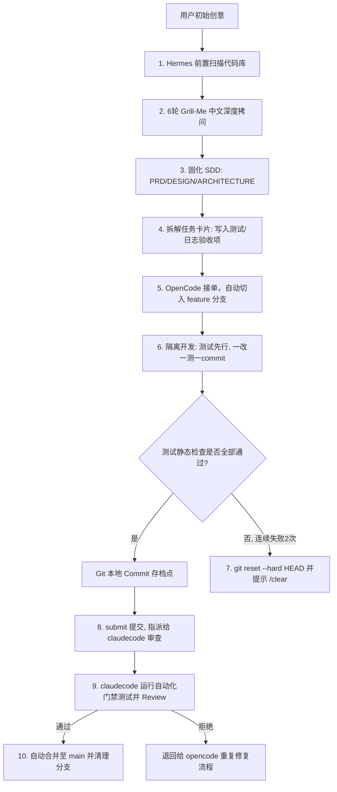

# AgentFlow Vibe Coding 规范深度重构设计文档

本文档定义了对 AgentFlow 本地多智能体协作框架的规则体系（`.cursorrules`/`.clinerules`）以及 `Hermes (Planner)`、`OpenCode (Refactorer)` 提示词的升级设计。本次重构完全融合了 2026 年 5 月版《Vibe Coding 完整教程：从入门到进阶工作流》的工程化实战经验。

## 1. 目标与非目标

### 目标 (Goals)
- 升级 `hermes.md` 提示词，落实 6 轮 Grill-Me 深度需求拷问规范，强化“非目标清单”与“可量化验收标准”的收敛。
- 任务卡片拆包机制深度契约化，将日志/可观测性埋点以及测试先行用例明确列入每个任务的 Checklist 验收项。
- 升级 `opencode.md` 提示词，融入 Git 刹车隔离机制、向下兼容 API 渐进重构规范，以及防范上下文腐化的重置与回滚自愈流程。
- 优化 `agentflow.py`，提炼并同步更新根目录 `.cursorrules`/`.clinerules` 中的“五稳”开发哲学、四步闭环流（探索->规划->实现->提交）、精确 `@` 文件引用，以及纠错 2 次即回退重置的规则。

### 非目标 (Non-Goals)
- 不改变 AgentFlow 命令行工具的核心流程（add/list/start/submit/review 的命令参数不变，以确保向后兼容）。
- 本次重构不修改业务代码，只优化提示词规范、系统模板、文档及工作流控制层。

## 2. 详细设计与实现方案

### 2.1 Hermes (Planner) 提示词重构 (.agentflow/prompts/hermes.md)
- **需求收敛**：强制在 Grill-Me 深度访谈中，梳理出该需求的“技术限制”、“非目标范围（不做什么）”和“定义完成验收标准（怎么算做完）”。
- **可观测性日志契约**：要求在每个 Task 的 Markdown 验收条件中，显式列出日志记录项，日志需包含微服务和模块的主要操作节点（例如：`create_task_start`, `create_task_validation_failed`, `create_task_success`）。
- **测试先行契约**：明确在验收项中写明需要运行的测试命令（如 `npm run test`、`pytest` 等）以及验证标准。

### 2.2 OpenCode (Refactorer) 提示词重构 (.agentflow/prompts/opencode.md)
- **隔离分支与 Git 刹车**：接单后立刻运行在 `feature/TASK-XXX` 分支上；严格按照 Checklist 验收项“小步提交”，跑通测试即 `git commit`；一旦连续 2 次纠错失败，必须运行 `git reset --hard HEAD`。
- **向下兼容重构**：更新公共 API 和库时，不能破坏原有系统编译。旧接口需打上 `@deprecated` 并在新旧映射中渐进过度，最后再清理废弃代码。
- **上下文重置**：回滚后必须提示用户输入 `/clear` 以重置聊天，避免“厨房水槽式会话”引起的大脑宿醉与幻觉。

### 2.3 AgentFlow CLI 脚本优化 (.agentflow/agentflow.py)
- **同步规则模板 (sync_rules)**：
  - 全面融入 Vibe Coding **“五稳”原则**（需求稳、结构稳、质量稳、排错稳、交付稳）与**“九阳神功”**（夯、抄、学、喂、规、验、测、扩、收）。
  - 新增关于使用 `/clear` 规避上下文腐化和使用 `@` 符号精确文件引用的工作流约束。

## 3. 验证计划

1. **自动构建验证**：
   - 运行 `python .agentflow/agentflow.py sync` 同步规则文件。
   - 检查根目录下生成的 `.cursorrules` 与 `.clinerules` 内容是否完备，且 SSOT 唯一真源映射无误。
2. **命令流程闭环验证**：
   - 模拟任务接单和提审流程，确保 `agentflow.py` 命令无语法错误，自动测试门禁和 Git 合并清理逻辑畅通。
